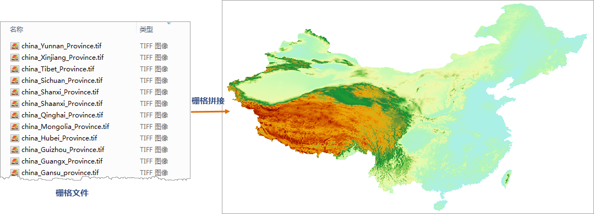

---
id: RasterSplice
title: 栅格拼接  
---  
 ### 功能说明

栅格拼接是指将多个栅格数据文件或多幅影像文件进行合并，快速的批量拼接成一份数据。同时支持数据集和本地文件进行混合拼接，减少数据导入过程，提升数据处理效率。

 ### 功能原理

程序根据输入的待拼接数据类型，创建一个空的目标栅格/影像数据集，目标数据集的坐标系、像素格式、波段数等信息与待拼接数据相同；并将所输入的待拼接数据的并集范围的外接矩形，作为目标数据集范围；同时将待拼接的数据以数据追加的方式导入目标数据集中，最终得到拼接结果数据集。

 ### 应用场景

 栅格数据拼接在实际的应用场景很广，例如无人机航拍，遥感影像等图像处理中；尤其适用大数据量的数据拼接，能够极大的提升用户数据处理效率。

 ### 功能入口

 单击 **数据** 选项卡- **数据处理** - **栅格拼接** 按钮。

 ### 参数说明

   * **数据类型** ：可参与拼接的数据类型有 **栅格** 和 **影像**
两类，拼接功能只能在同一类数据之间进行，因此，在添加数据之前需要确定拼接的数据类型，程序默认为栅格。选择数据集类型后，系统会根据所选的栅格数据集类型进行自动过滤。

   * **添加文件/添加数据集** ：支持添加数据集和文件两种类型，可通过工具栏中的“ **添加文件** ”、“ **添加数据集**
”按钮执行数据添加操作，数据说明如下：

     * 输入的待拼接数据的坐标系需一致；

     * 输入的待拼接数据的像素格式需一致。

     * 若输入的待拼接数据为影像数据，波段数需一致。

   * **编码类型** ：设置结果数据集的编码方式，包括
SGL、DCT、LZW、PNG、复合编码等编码方式，默认为不进行编码。具体编码方式说明请参见[数据集压缩编码方式](../../DataProcessing/DataManagement/EncodeType)。

 **应用实例** ：

 现有全国34个省级行政区域的DEM栅格数据文件，数据文件的坐标系、像素格式等信息相同，通过栅格拼接功能快速拼接得到如下图所示结果：

   
