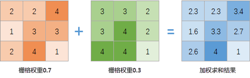
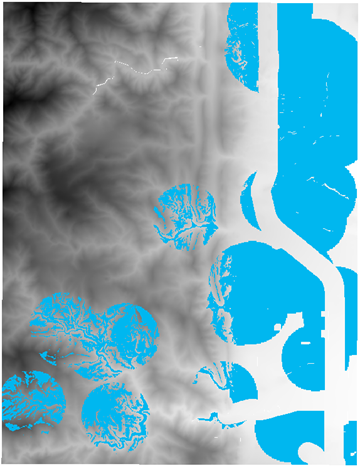

### 功能说明

加权总和是指将多个栅格数据按指定的权重，叠加成一个栅格。计算原理为：每个栅格数据的栅格值*对应的权重后，再将同位置的栅格像元相加，即可得到结果数据。如下图所示，以左上角第一个像元为例：栅格值2
* 权重0.7 + 栅格值3 * 权重0.3 = 2.3。

  
---  
加权总和原理示意图  
  
**适用数据** :栅格数据。

### 应用场景

加权总和常应用于：

* 植被、农作物等适宜性分析;
* 学校、公园等选址分析。

### 功能入口

单击 **数据** 选项卡-> **数据处理** -> **加权总和** 按钮。

### 参数说明

* **添加数据** ：单击工具栏中的“ **添加** ”按钮，在 **选择** 对话框中选中输入的栅格数据，数据说明如下： 
    * 输入的栅格数据坐标系需一致；
    * 栅格像素格式可以为浮点型、整型、无符号等类型，可不一致；
* **权重** ：设置栅格数据的权重值，可以是正值、负值、整数、小数值，也不限定必须为相对百分比，所有权重值的总和也无需等于 1。例如在进行农作物适宜性分析时，光照影响因素占50%，坡度影响因素占20%，坡向影响为30%，则光照的权重可设为0.5，坡度的权重可设为0.2，坡向的权重可设为0.3。
* **像素格式** ：默认为第一个栅格数据的像素格式，提供了1位、4位、8位、16位、32位、64位、单精度浮点型和双精度浮点型等11种格式，每种格式的具体说明请参见[栅格数据集像素类格式](../../Analyst/VectorRasterConvert/PixelFormat.htm)。
* **对数据集进行压缩储存** ：勾选该复选框以后，系统会对结果数据集进行压缩存储，否则将不进行压缩存储。
* **忽略无值栅格单元** ：勾选该复选框以后，输入栅格数据集中的无值栅格单元将不参与代数运算，结果数据集中相应位置的像元值仍为空值（通常为-9999）；若不勾选该项，则系统会将无值栅格单元的像元值作为普通像元值参与运算，此时会导致结果栅格数据集的极小值（或极大值）发生改变。
* **环境设置** ：分析环境包括结果数据集的地理范围、裁剪范围、默认输出分辨率等参数进行设定，具体说明请参见[设置分析环境](../../Analyst/Raster/AnalystEnvironment.htm)。

### 应用示例

现有公园规划选址各因素的栅格数据，依据如下条件，进行公园选址。

* **地势** ：坡度小于 20°;
* **高程** ：高程值在 1000～1800m；
* **与湖泊的距离** ：距离湖泊不超过 1km；
* **与街道距离** ：候选区不应该在主要街道的 300m 缓冲区内，

**数据准备** ：地形数据、湖泊数据、公园数据、道路数据。

**操作说明**

1. 坡度：对地形数据进行坡度分析，再对坡度数据进行代数运算，将坡度小于等于20的赋值为1，大于20赋值为0，运算表达式为：Con([Slope]>=20, 1, 0)。
2. 高程：对地形数据进行代数运算，将1000≤高程≤1800赋值为1，其他赋值为0，运算表达式为：Con(1000>=[terrain]>=1800,1,0)。
3. 湖泊：先设置栅格分析环境的分析范围为地形数据，再对湖泊数据生成距离栅格，对分析得到的距离栅格进行代数运算，将距离小于等于1000的赋值为1，其他赋值为0，运算表达式为：Con( [LakesDis] >= 1000,1,0)。
4. 道路：对道路数据生成距离栅格，对分析得到的距离栅格进行代数运算，将距离大于等于300的赋值为1，其他赋值为0，运算表达式为：Con( [LakesDis] >= 300,1,0)。
5. 加权总和：单击 **数据** 选项卡-> **数据处理** -> **加权总和** 按钮，在弹出对话框中添加坡度、高程、湖泊、道路代数运算后的栅格数据，分别将权重值设置为0.3、0.25、0.2、0.15。
6. 对加权求和后的数据进行栅格代数运算，将栅格值大于等于1的赋值为1，其他的赋值为0，计算结果与已有公园做裁剪，只保留已有公园区域外的数据，裁剪后栅格值为1的则表示适宜建公园，结果如下图蓝色区域所示：    
  
