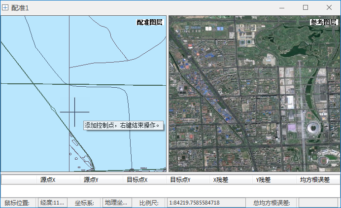

以下主要通过数据配准实例，介绍如何使用
桌面应用系统进行数据配准，现有一份预配准数据，为北京某区域的矢量数据，其中包含地铁数据集（subway_ln_wgs84）、道路数据集（RoadCent_ln_wgs84）。由于数据发生了偏移，无法表示其真实位置。需要将以上数据集按照高清的影像数据进行配准，以纠正偏移误差。

### 操作步骤

  1. 点击功能区 >“ **开始** ”选项卡 >“ **数据处理** ”组 >“ **配准** ”按钮，选择“新建配准”，弹出数据配准的向导对话框，根据向导提示进行数据配准的操作。
  2. **步骤一：选择配准数据** ：在该对话框单击“添加”按钮，在“选择”对话框中选择需要配准的数据： 
    * 支持添加多个数据集进行配准；
    * 同时支持选择地图作为配准数据，选择某一个地图，则地图中的所有图层均被选择为配准数据。

此处添加地铁数据集（subway_ln_wgs84）、道路数据集（RoadCent_ln_wgs84）两个矢量数据集。

  3. **步骤二：选择参考数据** ：支持选择某一 **数据集** ，同时支持选择工作空间中已配置好的 **地图** 作为参考数据。此处选择该区域高清的影像图层作为参考图层。
  4. 点击“完成”按钮，完成新建配准的向导操作，进入配准状态。界面会自动切换到“配准”选项卡下的配准窗口，如下图所示：
  

**注**
：若用户需要对已添加的配准图层和参考图层进行新增、删除、排序等操作时，可在相应配准窗口的图层管理器进行操作。同时支持拖拽工作空间管理器中的数据集或地图至配准图层窗口或参考图层窗口直接打开数据。

  5. **设置影像拉伸方式** ：当用户的配准图层或参考图层中存在影像数据时，支持在"配准"选项卡“影像拉伸”组，分别对配准图层和参考图层的影像数据设置拉伸方式，以便用户在配准刺点过程中获得最佳的图层显示效果。 

应用程序提供三种拉伸方式：无拉伸、最值拉伸、标准差拉伸、高斯拉伸。有关影像拉伸的介绍请参考[影像拉伸](../../../Features/Visualization/VisualSetting/Imagegroup.htm#1)。

###  相关主题

  * 新建完一个配准窗口以后，可以进入配准[第二步 选择控制点](Poniting.htm)。
  * 如果已有控制点的配准信息文件（*.drfu）,可直接导入该控制点文件，有关导入配准信息文件请参见：[导入/导出配准信息文件](importGCP.htm)。

