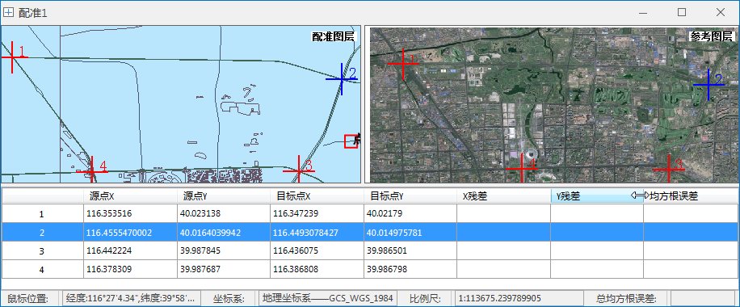

在配准过程中，添加控制点是非常重要的步骤。由于配准图层和参考图层反映了相同或部分的空间位置的特征，因此需要在配准图层的特征点位置添加配准控制点，同时在参考图层的相应特征位置寻找该点的同名点。

此过程实质是识别一系列控制点（ x,y 坐标），以将配准数据集的位置与参考数据的位置链接起来。控制点是在配准数据集和实际坐标中可以精确识别的位置。

选择的控制点精度、数量以及这些点的分布位置在很大程度上决定了数据配准的精度。选择控制点时应该注意以下几点：

  1. 控制点一般应选择标志较为明确、固定，并且在配准图层和参考图层上都容易辨认的突出地图特征点，比如道路的交叉点、河流主干处、田地拐角等；
  2. 控制点在图层上必须均匀分布，否则配准较密集的区域精度好，而比稀疏的地方，配准的精度就差。并且能通过控制点反映整个图像的趋势；
  3. 控制点的数量应适当，控制点不是越多越好，应该根据实际情况适当选取。而且必须满足相应配准算法的数目要求。

控制点提供了刺点和导入两种添加方式，具体操作方式说明如下：

### 刺点

1. 在配准窗口，可通过“ **配准** ”选项卡“ **浏览** ”组中，使用“ **放大** ”、“ **缩小** ”或者“ **漫游** ”等按钮进行浏览操作，还可修改配准窗口及参考窗口的背景色。
2. 在“ **配准** ”选项卡“ **控制点设置** ”中，点击“ **刺点** ”按钮，鼠标状态变为十字光标，找准定位的特征点位置，点击鼠标左键，完成一次刺点操作。可以看到在鼠标点击位置，用蓝色十字丝标记（默认当前所刺的控制点为选中状态）。同时在控制点列表中，系统会自动给配准控制点编号，同时将其坐标值显示在控制点列表中，即源点 X 和源点 Y 两列中的内容。
3. 同样的操作方法，在参考图层的同名点位置，点击鼠标左键，完成参考图层的一次刺点操作。可以看到在鼠标点击位置，用蓝色十字丝标记（默认当前所刺的控制点为选中状态）。同时在控制点列表中，系统会自动给配准控制点编号，同时将其坐标值显示在控制点列表中，即目标点 X 和目标点 Y 两列中的内容。
4. 重复2-3步的操作过程，完成多个控制点的刺点操作。根据此次实例中采用的配准算法，至少需要选择4个控制点，这些点的分布情况如下图所示：

  
---  

### 导入控制点

导入控制点是指将当前工作空间中的点数据集导入为配准点和参考点。

1. 功能入口有如下三处： 
* 在“ **配准** ”选项卡“ **控制点设置** ”中，点击“ **导入** ”按钮；
* 在配准地图窗口中单击鼠标右键，选择“导入控制点”选项；
* 在配准控制点列表窗口中单击鼠标右键，选择“导入控制点”选项；
2. 在弹出的导入控制点对话框中，设置以下参数： 
* 配准点：设置是否导入配准点，若勾选该复选框，则选择当前工作空间中的点数据集作为配准点。
* 参考点：设置是否导入参考点，若勾选该复选框，则选择当前工作空间中的点数据集作为参考点。
* 清除当前控制点：若勾选该复选框，则会清除当前地图中的控制点；若未勾选，则表示保留地图中的控制点。
3. 点击“确定”按钮，即可将指定的控制点导入到当前地图窗口中。

### 导出控制点

导出控制点是指将刺的控制点导出为点数据集。

1. 功能入口有如下三处： 
* 在“ **配准** ”选项卡“ **控制点设置** ”中，点击“ **导出** ”按钮；
* 在配准地图窗口中单击鼠标右键，选择“导出控制点”选项；
* 在配准控制点列表窗口中单击鼠标右键，选择“导出控制点”选项；
2. 在弹出的“导出控制点”对话框中，设置以下参数： 
* 配准点：设置是否导出配准点，若勾选该复选框，可将当前地图中的配准点导出为点数据集。
* 参考点：设置是否导出参考点，若勾选该复选框，可将当前地图中的参考点导出为点数据集。
3. 点击“确定”按钮，即可将控制点导出为点数据集。

###  相关主题

* 完成控制点的选择操作后，可以进行下面的操作，请参见：[第三步 计算误差](CalculatError.htm)。
* 如果需要导入已有的控制点文件，或者需要将所刺的控制点保存下来以备再次使用，可以使用控制点列表中的导入控制信息或者导出控制信息功能。具体操作请参见：[导入/导出配准信息文件](importGCP.htm)。

