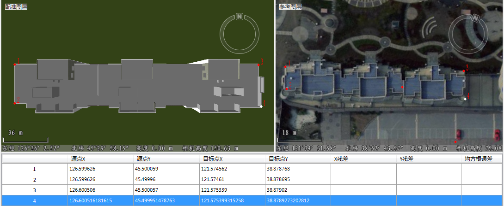

---
id: Poniting3D
title: 第二步 选择控制点  
---  

在配准过程中，选择控制点是非常重要的步骤。由于配准图层和参考图层反映了相同或部分的空间位置的特征，因此需要在配准图层的特征点位置选择配准控制点，同时在参考图层的相应特征位置寻找该点的同名点。

 此过程实质是识别一系列控制点（ x,y 坐标），以将配准数据集的位置与参考数据的位置链接起来。控制点是在配准数据集和实际坐标中可以精确识别的位置。

 选择的控制点精度、数量以及这些点的分布位置在很大程度上决定了数据配准的精度。选择控制点时应该注意以下几点：

   1. 控制点一般应选择标志较为明确、固定，并且在配准图层和参考图层上都容易辨认的突出地图特征点，比如建筑边缘顶点等；

   2. 控制点在图层上必须均匀分布，否则配准较密集的区域精度好，而比稀疏的地方，配准的精度就差。并且能通过控制点反映整个图像的趋势；

   3. 控制点的数量应适当，控制点不是越多越好，应该根据实际情况适当选取。而且必须满足相应配准算法的数目要求。

 ### 操作步骤

   1. 在配准窗口，可通过“ **配准** ”选项卡“ **浏览** ”组中， 使用“ **选择漫游** ”或者“ **漫游** ”等按钮进行浏览操作

   2. 在“ **配准** ”选项卡“ **控制点设置** ”中，点击“ **刺点** ”按钮，鼠标状态变为十字光标，
找准定位的特征点位置，点击鼠标左键，完成一次刺点操作。可以看到在鼠标点击位置，用蓝色十字丝标记（默认当前所刺的控制点为选中状态）。
同时在控制点列表中，系统会自动给配准控制点编号，同时将其坐标值显示在控制点列表中，即源点 X 和源点 Y 两列中的内容。

   3. 同样的操作方法，在参考图层的同名点位置，点击鼠标左键，完成参考图层的一次刺点操作。
可以看到在鼠标点击位置，用蓝色十字丝标记（默认当前所刺的控制点为选中状态）。
同时在控制点列表中，系统会自动给配准控制点编号，同时将其坐标值显示在控制点列表中，即目标点 X 和目标点 Y 两列中的内容。

   4. 重复2-3步的操作过程，完成多个控制点的刺点操作。根据此次实例中采用的配准算法，至少需要选择4个控制点，这些点的分布情况如下图所示：

   
 ---  

 ### 相关主题

   * 完成控制点的选择操作后，可以进行下面的操作，请参见：[第三步 计算误差](CalculatError3D)。

   * 如果需要导入已有的控制点文件，或者需要将所刺的控制点保存下来以备再次使用，可以使用控制点列表中的导入控制信息或者导出控制信息功能。具体操作请参见：[导入/导出配准信息文件](importGCP3D)。

