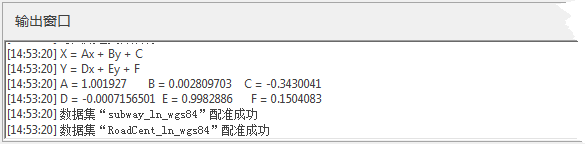
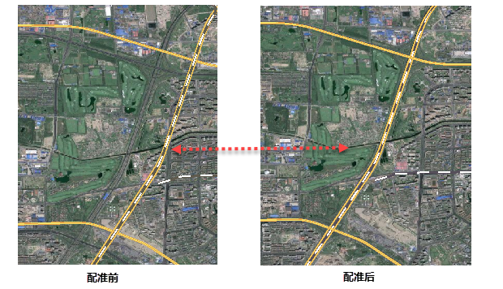

“配准”选项卡中“运算”组的“配准”按钮用来执行配准功能。只有当控制点列表中的控制点数目满足当前配准算法的要求的最少控制点数目时，“配准”按钮才为可用状态。

### 操作步骤

  1. 在“ **配准** ”选项卡的“ **运算** ”组，点击“ **配准** ”按钮，会弹出“ **配准结果设置** ”对话框。如果是对栅格/影像数据集进行批量配准，用户还需要设置是否进行重采样，重采样的模式以及像素大小等内容。设置方法请参见：栅格/影像参数。 
  2. **执行配准** ：如果是进行矢量配准，并且配准方式为线性配准或者二次多项式配准，在配准结束后，应用程序会在输出窗口中显示配准转换的公式及各个参数值，以便用户查阅。如下图所示：  
      

  3. 在将配准后的矢量数据叠加在影像上，查看配准结果，放大至道路交叉口，可看到配准前道路偏移严重，而配准后与影像道路重合，配准成功。如下图所示：
  
