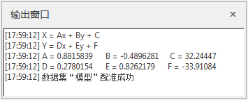
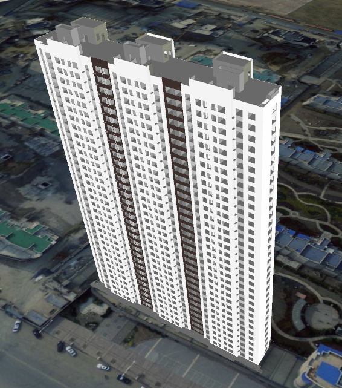

“配准”选项卡中“运算”组的“配准”按钮用来执行配准功能。只有当控制点列表中的控制点数目满足当前配准算法的要求的最少控制点数目时，“配准”按钮才为可用状态。

### 操作步骤

  1. 在“ **配准** ”选项卡的“ **运算** ”组，点击“ **配准** ”按钮，会弹出“ **配准结果设置** ”对话框。 
  2. **执行配准** ：在配准结束后，应用程序会在输出窗口中显示配准转换的公式及各个参数值，以便用户查阅。如下图所示：   
     

  3. 在将配准后的模型数据叠加在影像上，查看配准结果，可看到配准后模型与影像重合，配准成功。如下图所示：  
    
