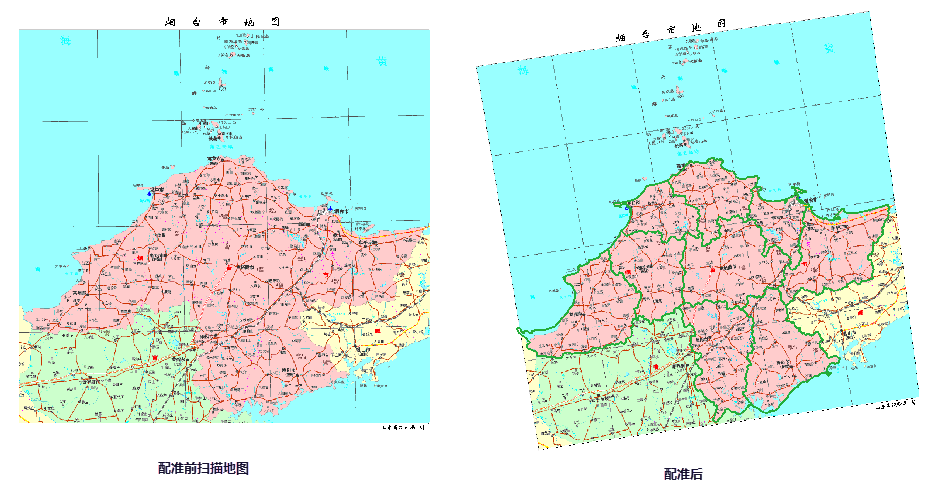

遥感影像数据在成像过程中存在多种几何畸变，需要通过配准操作对影像/栅格数据集的坐标进行纠正；纸质地图保存过程中存在纸张变形，扫描后的图纸容易产生误差变形，并且纸图扫描后的图纸都是没有空间位置的，需要通过数据配准将其纠正到地理坐标系或投影坐等参考统中，同时也可以纠正几何畸变和变形误差，达到同一区域不同数据集地理坐标的统一。另一种情形是，在对多个数据集进行分析时，例如影像镶嵌、矢量数据合并或者叠加，要求所有参与分析的数据集在同一坐标系下，此时也需要进行数据的配准。

**数据配准原理**

数据配准是通过参考数据集（图层）对配准数据集（图层）进行空间位置纠正和变换的过程。通过确定的配准算法和控制点信息，对配准数据集进行配准，可以得到与参考数据集（图层）空间位置一致的配准结果数据集。

在指定参考图层的情况下，需要在配准图层中选择合适的配准点，同时在参考图层的相应位置上也需要选择控制点。配准过程会将配准图层中配准点位置通过一定的配准算法，转换到与参考图层一致的空间位置。在不指定参考图层的情况下，需要在配准图层选择合适的配准点，同时在“输入控制点”对话框中输入与配准点相应位置的控制点坐标。

桌面应用系统支持对单个或多个数据集进行配准，并支持通过配准信息文件（*.drfu）进行快速配准。

一般配准过程分为以下步骤：

**[第一步 新建配准](NewRegistration.htm)** ：选择一个或多个配准数据，建立配准图层与参考图层的配准关系。

**[第二步 选择控制点](Poniting.htm)**
：即刺点的过程，是配准的关键步骤，在配准图层和参考图层选择相同空间位置的特征同名点。也可通过导入已有控制点配准信息文件（*.drfu）进行配准。

**[第三步 计算误差](CalculatError.htm)** ：选择配准算进行配准误差的计算。应用程序会计算所有控制点的 X 残差、Y
残差、均方根误差以及均方根总误差，已校验控制点选择的精度。

**[第四步 执行配准](Registrating.htm)** ：当计算误差在配准精度的要求范围，即可执行配准。并支持对配准信息文件的导出。

### 应用实例：

通过在
桌面应用系统中进行配准操作，对扫描的烟台市地图进行配准，使其与烟台市的矢量面数据集（参考图层）坐标系一致，并且能够很好的与扫描图片相匹配，配准结果与参考数据集叠加显示的效果如下图所示。

  
---  
  
底图为配准后的扫描图片，绿色的线为参考数据集，使用的是 yantaiR 面数据集，对其进行透明化显示处理。

  
  
---

