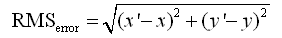
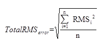

在进行配准过程中，应用程序会计算所有控制点的 X 残差、Y 残差、均方根误差以及均方根总误差。下面详细介绍这四种误差的具体含义。

残差是指实际观测值与回归估计值的差。在配准过程中，观测点为参考图层上的控制点，可以是在参考图层刺点所得点，也可以是通过输入 X、Y
坐标所得的控制点。计算点为在配准图层刺点所得控制点，按照某一种配准算法计算出来的拟合点。

  * **X 残差**

X 残差是观测点与计算点在 X 坐标方向上的距离。

  * **Y 残差**

Y 残差是观测点与计算点在 Y 坐标方向上的距离。

  * **均方根误差**

对于线性配准和多项式配准，在选择了一定的地面控制点后，都用以下的公式计算每个地面控制点的均方根误差（RMSerror）：

  
---  
  
式中，x，y
为地面控制点在原始图像中的坐标，x′，y′是一次或二次多项式计算出的控制点坐标，即估算坐标。估算坐标和原始坐标之间的差值大小代表了每个控制点几何纠正的精度。对线性配准和多项式配准，系统都会计算
x，y 方向上的和点的均方根误差。通常一个 GIS
应用都有一个可以接受的总均方根误差，所以当某些控制点的均方根误差大于可接受的总均方根误差时，可以通过剔除或修改该控制点，减小总体均方根误差，提高配准精度的目的。

  * **总均方根误差**

配准时的总体均方根误差，反映的是所有配准点进行配准时，产生的误差累加，通常将其作为匹配结果的精度校验值。总体均方根误差（TotalRMSerror）使用下面的公式计算：

  
---  
  
式中，n 代表配准中选择的控制点个数，RMS
的值为控制点的均方根误差，当某些控制点的均方根误差大于可接受的总均方根误差时，可以剔除或调整这些控制点来以提高保证整体的总体均方根误差在可接受范围内。

