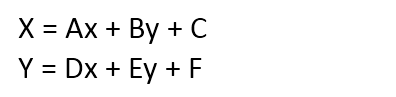
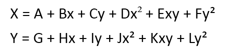

---
id: RegistrationMode
title: 配准算法介绍  
---  
 应用程序提供了四种配准方法，线性配准、二次多项式配准、矩形配准和偏移配准。下面部分将详细介绍这几种配准方法和相关概念。

   1. **线性配准**

 也称仿射变换。这种配准方法假设地图因变形而引起的实际比例尺在 X 和 Y 方向上不相同，因此，具有纠正地图变形的功能。假设 x, y
为输入图像的原始坐标，X，Y 为纠正后的输出坐标，则坐标变换的公式如下：

   
 ---  
  

上式中有6个参数:A、B、C、D、E、F，可以通过选择配准图层和参考图层的同名控制点来确定。理论上要求上述6个待定参数，至少需要知道不在同一直线上的3对控制点坐标，才能实现线性变换。如果取常数项参数
C、F 为0，则至少需要4个点，所以实际应用中，通常利用4个或者4个以上的控制点来进行线性配准。待定系数是通过最小二乘法的原理进行求解的。

 线性变换是最常用的一种配准方法，由于同时考虑了 X 和 Y
方向上的变形，所以纠正后的坐标在不同的方向上的长度比会不同，表现为原始坐标会发生如缩放、旋转、平移等变化后得到输出坐标。

   2. **二次多项式配准**

是常用的精度较高的配准方法。多项式纠正把原始图像变形看成是某种曲面，输出图像为规则平面。从理论上讲，任何曲面都能以适当高次的多项式来拟合。一般用二次二项式就可以对变形比较严重的图像进行纠正，并得到较高的精度。二次二项式的纠正公式如下：

   
 ---  
  

上式中共有12个参数，理论上需要6对控制点就可实现转换，但为了得到比较高的精度，一般要求二次多项式纠正的控制点为至少7对，适当增加控制点的个数，可以明显提高影像配准的精度。多项式系数是用所选定的控制点坐标，按照最小二乘法求得的。对比多项式纠正公式与线性纠正的公式，可以看出线性配准其实是一次的多项式配准，二次多项式纠正比线性配准需要更多的控制点对，也会纠正更多的变形。

   3. **矩形配准**

实质上是一种特殊的，有限定条件的线性配准。如果原图像为规则矩形，纠正后的图像坐标仍是规则矩形，则选择两个相对的角点就可以确定矩形4个角点的坐标，在线性配准的纠正公式中的常数项取作0，则已知2个相对角点坐标就可以求解得到纠正公式，从而实现几何纠正。这种方法既方便省时，也避免了由于选择多个控制点时造成的误差累积。矩形配准是一种简单方便的配准纠正方法，但是因为输出结果不会计算误差，所以其配准的精度不可知，是一种精度不高的粗纠正方法。

   4. **偏移配准**

 偏移配准仅需要一组控制点和参考点，分别对 X 坐标和 Y 坐标求差值，再利用差值对原数据集所有组坐标点进行偏移。

 ###  注意事项

   1. 偏移配准方法不需要进行误差计算，实际上是通过计算原点与目标点的 x 坐标值之差、y 坐标值之差来分别进行 x、y 轴方向上的偏移来实现配准的。

