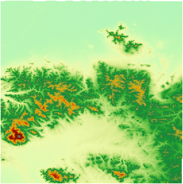

---
id: resamplesize
title: 设置重采样像素大小  
---  
 ### 使用说明

 像元是栅格/影像数据最基本的信息单元，像元的坐标位置由行号和列号确定，每个像元都有一个属性值，这个属性值代表了该像元对应位置的信息，比如 DEM
栅格像元反映该像元出对应地面的高程信息。像元大小，又称空间分辨率，是指单个像元所对应的地面面积大小。

 对一幅空间分比率固定的栅格/影像数据，可以通过重采样的方式，改变像元大小。

 “栅格/影像参数”组中“像素”右侧的文本框，用来设定重采样后的像素大小。

 ### 操作步骤

   1. 在" **配准** "选项卡的" **栅格/影像参数** "组中，在“ **像素**
”标签右侧的文本框内输入重采样后的像素大小。像素大小的单位与待配准图层的投影坐标系的单位一致。

   2. 对栅格/影像数据集执行配准操作，查看保存的配准结果数据集属性信息，可以看到栅格/影像数据集的 X 分辨率和 Y 分辨率数值发生了改变。

 下面以双线性内插法为例，在地理坐标系下，对像素大小为0.00027栅格进行重采样。重采样后的像素大小为0.013。下图为配准后的效果图。

  

 ### 注意事项

   1. 像素大小的单位与投影坐标系的单位一致。如果配准图层的坐标系为投影坐标系，单位为米、千米、英尺等，如果配准图层的坐标系为地理坐标系，则单位为度、分、秒。

   2. 选择合适的像素大小对栅格/影像数据进行重采样，像素数值过大，会造成信息的丢失；像素数值过小，不能达到重采样的目的。

  
