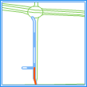
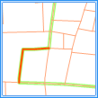
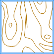
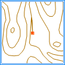
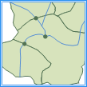

---
id: TopoRule
title: 拓扑检查规则  
---  
 拓扑检查是为了检查出点、线、面数据集本身及不同类型数据集相互之间不符合拓扑规则的对象。主要用于数据编辑和拓扑分析预处理。

 SuperMap 提供了强大的拓扑检查功能，为点数据集提供6种拓扑规则、为线数据集提供14种拓扑规则、为面数据集提供10种拓扑规则，此外，还提供5种适用于不同类型数据集的拓扑规则，基本能够满足所有的拓扑检查需求。

 下面将分别介绍适用于点、线、面数据集的拓扑规则和适用于多种类型数据集的拓扑规则。

 ### 适用于点数据集的规则

 以下各拓扑规则仅适用于点数据集。

<table class="normaltable" width="95%">
<thead>
<tr class="normaltableTitle">
	<td width="15%">名称</td>
	<td width="55%">含义</td>
	<td width="30%">图示</td>
</tr>
</thead>
<tr class="normaltablecontent2">
	<td>点必须在线上</td>
    <td>
检查点数据集中是否存在未被参考线数据集的线覆盖的点对象，即点必须在参考线数据集的线对象上，包括在线内、线节点和线端点上，但是不能在线外。如高速公路上的收费站，必须设置在高速公路上。

    	
未被线覆盖的点对象将作为拓扑错误生成到结果数据集中。

        
错误数据集类型：点数据集。
</td>
    <td>&nbsp;&nbsp;</td>
</tr>
<tr class="normaltablecontent1">
	<td>点必须在面的边界上</td>
    <td>
检查点数据集中是否存在没有在参考面数据集的面边界上的点对象，即点对象不能位于参考面数据的面内和面外。如界碑必须设置在国界线和行政界线上。

    	
不在面边界上的点对象将作为拓扑错误生成到结果数据集中。

        
错误数据集类型：点数据集。
</td>
    <td>&nbsp;&nbsp;</td>
</tr>
<tr class="normaltablecontent2">
	<td>点被面完全包含</td>
    <td>
检查点数据集中是否存在不在参考面数据集中面内部的点对象，即点对象不能位于参考面数据集的面外或面的边界上。如表示省会的点必须设置在省域范围内。

    	
不在面内的点对象将作为拓扑错误生成到结果数据集中。

        
错误数据集类型：点数据集。
</td>
    <td>&nbsp;&nbsp;</td>
</tr>
<tr class="normaltablecontent1">
	<td>点必须被线端点覆盖</td>
    <td>
检查点数据集中是否存在未被参考线数据集的线端点覆盖的点对象，即点只能在参考线数据集中线对象的端点上，而不能在线的节点上、线内其它位置和线外。

    	
未被线端点覆盖的点对象将作为拓扑错误生成到结果数据集中。

        
错误数据集类型：点数据集。
</td>
    <td>&nbsp;&nbsp;</td>
</tr>
<tr class="normaltablecontent2">
	<td>无重复点</td>
    <td>
检查一个点数据集中是否存在重复的点对象。如消防站、学校等公共设施，在地图上通常以点数据集的形式存在，在同一位置只能存在一个。

        
重复的点对象将作为拓扑错误生成到结果数据集中。

        
错误数据集类型：点数据集。
</td>
    <td>&nbsp;&nbsp;</td>
</tr>
<tr class="normaltablecontent1">
	<td>点不被面包含</td>
    <td>
检查点数据集中是否存在被参考面数据集的面包含的点对象。若点对象在面边界上或在面外，则被视为正确的拓扑关系。

    	
被面包含的点对象将作为拓扑错误生成到结果数据集中。

        
错误数据集类型：点数据集。
</td>
    <td>&nbsp;&nbsp;</td>
</tr>

</table>
  
### 适用于线数据集的规则

 以下各拓扑规则仅适用于线数据集。

<table class="normaltable" width="95%">
<thead>
<tr class="normaltableTitle">
	<td width="15%">名称</td>
	<td width="55%">含义</td>
	<td width="30%">图示</td>
</tr>
</thead>
<tr class="normaltablecontent2">
	<td>线与线无相交</td>
    <td>
检查线数据集中是否存在与参考线数据集的线相交的线对象，即两个线数据集中的所有线对象必须相互分离。

    	
交点将作为拓扑错误生成到结果数据集中。

        
错误数据集类型：点数据集。
</td>
    <td>&nbsp;&nbsp;</td>
</tr>
<tr class="normaltablecontent1">
	<td>线内无相交</td>
    <td>
检查一个线数据集中是否存在两个（或两个以上）相交且共享交点，但并未从交点处打断的线对象。若有端点和线内部接触及端点和端点接触的情况，则被视为正确的拓扑关系。此外，对于相交但不共享交点的线对象，也被视为正确的拓扑关系。如道路数据，当多条行车道在普通路口（十字路口、丁字路口等）相交时，则视为相交且共享交点的情况，应被打断；而多条行车道通过立交桥或隧道相交时，则被视为相交但不共享交点的情况，此时不需要打断。

    	
交点将作为拓扑错误生成到结果数据集中。

        
错误数据集类型：点数据集。
</td>
    <td>&nbsp;&nbsp;</td>
</tr>
<tr class="normaltablecontent2">
	<td>线内无重叠</td>
    <td>
检查一个线数据集中是否存在两个（或两个以上）线对象之间有相互重叠的部分，且重叠部分共享节点。如城市街道，单条街道或多条街道之间可以相交但不能出现相同的路线。

    	
重叠部分将作为拓扑错误生成到结果数据集中。

        
错误数据集类型：线数据集。
</td>
    <td>&nbsp;&nbsp;</td>
</tr>
<tr class="normaltablecontent1">
	<td>线内无悬线</td>
    <td>
检查一个线数据集中是否存在被定义为悬线的线对象，即线对象的端点没有连接到其它线的内部或线的端点，包括长悬线和短悬线两种情况。如区域边界线等必须闭合的线可用此规则检查。

    	
悬点将作为拓扑错误生成到结果数据集中。

        
错误数据集类型：点数据集。
</td>
    <td>&nbsp;&nbsp;</td>
</tr>
<tr class="normaltablecontent2">
	<td>线内无假结点</td>
    <td>
检查一个线数据集中是否存在含有假结点（只连接两条弧段的结点）的线对象，即一个线对象必须与两个（或两个以上）线对象相连接。

    	
假结点将作为拓扑错误生成到结果数据集中。

        
错误数据集类型：点数据集。
</td>
    <td>&nbsp;&nbsp;</td>
</tr>
<tr class="normaltablecontent1">
	<td>线与线无重叠</td>
    <td>
检查线数据集中是否存在与参考线数据集的线重叠的线对象，且重叠部分共享节点，即两个线数据集之间的线对象不能有重合的部分。如交通路线数据中，公路和铁路不能重叠。

    	
重叠部分将作为拓扑错误生成到结果数据集中。

        
错误数据集类型：线数据集。
</td>
    <td>&nbsp;&nbsp;</td>
</tr>
<tr class="normaltablecontent2">
	<td>线内无相交或无内部接触</td>
    <td>
检查一个线数据集中是否存在两个（或两个以上）线对象在线的节点处或线的内部相交，即线对象只能在端点处与其他线相交，且所有交点必须是线的端点，所有相交的弧段必须被打断。该规则不检查线对象自相交的情况。

    	
交点将作为拓扑错误生成到结果数据集中。

        
错误数据集类型：点数据集。
</td>
    <td>&nbsp;&nbsp;</td>
</tr>
<tr class="normaltablecontent1">
	<td>线内无自交叠</td>
    <td>
检查一个线数据集中是否存在与自身重叠的线对象，即一个线对象本身不能有重叠部分。如在交通数据中，一条道路不能出现重复的路段。

    	
重叠部分将作为拓扑错误生成到结果数据集中。

        
错误数据集类型：线数据集。
</td>
    <td>&nbsp;&nbsp;</td>
</tr>
<tr class="normaltablecontent2">
	<td>线内无自相交</td>
    <td>
检查一个线数据集中是否存在与自身相交或重叠线对象，即线对象中不能有重叠（坐标相同）的节点。该规则多用于检查等值线这样的不能与自身相交的线。

    	
自相交的交点或重叠部分的端点将作为拓扑错误生成到结果数据集中。

        
错误数据集类型：点数据集。
</td>
    <td>&nbsp;&nbsp;</td>
</tr>
<tr class="normaltablecontent1">
	<td>线被多条线完全覆盖</td>
    <td>
检查线数据集中是否存在没有被参考线数据集的一条或多条线覆盖的线对象。如公交线路必须与道路重合，即被道路数据完全覆盖。

    	
未覆盖的部分将作为拓扑错误生成到结果数据集中。

        
错误数据集类型：线数据集。
</td>
    <td>&nbsp;&nbsp;</td>
</tr>
<tr class="normaltablecontent2">
	<td>线被面边界覆盖</td>
    <td>
检查线数据集中是否存在没有被参考面数据集的面边界（可以是一个或多个面边界）覆盖的线对象。如表示某一区域边界的线数据（某城区的边界线）必须被这一区域（城区）的边界覆盖。

    	
未被覆盖的部分将作为拓扑错误生成到结果数据集中。

        
错误数据集类型：线数据集。
</td>
    <td>&nbsp;&nbsp;</td>
</tr>
<tr class="normaltablecontent1">
	<td>线端点必须被点覆盖</td>
    <td>
检查线数据集中是否存在线端点未被参考点数据集的点覆盖的线对象。

    	
未被覆盖的端点将作为拓扑错误生成到结果数据集中。

        
错误数据集类型：点数据集。
</td>
    <td>&nbsp;&nbsp;</td>
</tr>
<tr class="normaltablecontent2">
	<td>线不能和面相交或被包含</td>
    <td>
检查线数据集中是否存在与参考面数据集的面相交或被面包含的线对象，即线数据集与参考面数据集不能存在交集。

    	
线、面数据集的交集部分将作为拓扑错误生成到结果数据集中。

        
错误数据集类型：线数据集。
</td>
    <td>&nbsp;&nbsp;</td>
</tr>
<tr class="normaltablecontent1">
	<td>线内无打折</td>
    <td>
检查线数据集中是否存在连续四个节点构成的两个夹角的角度都小于所给的角度值（单位为度），若两个夹角都小于角度值，则认为线对象在中间两个节点处打折。

    	
第一个打折点将作为错误生成到结果数据集中。

        
错误数据集类型：点数据集。
</td>
    <td>&nbsp;&nbsp;</td>
</tr>
</table>

 以下各拓扑规则仅适用于面数据集。

<table class="normaltable" width="95%">
<thead>
<tr class="normaltableTitle">
	<td width="15%">名称</td>
	<td width="55%">含义</td>
	<td width="30%">图示</td>
</tr>
</thead>
<tr class="normaltablecontent2">
	<td>面内无重叠</td>
    <td>
检查一个面数据集中是否存在两个（或两个以上）相互重叠的面对象，包括部分重叠和完全重叠。此规则多用于一个区域不能同时属于两个（或两个以上）面对象的情况，如行政区划面，一个地区不能同时属于两个行政区管辖。

    	
重叠部分将作为拓扑错误生成到结果数据集中。

        
错误数据集类型：面数据集。
</td>
    <td>&nbsp;&nbsp;</td>
</tr>
<tr class="normaltablecontent1">
	<td>面内无缝隙</td>
    <td>
检查一个面数据集中相邻面对象之间是否存在空隙，即相邻面对象之间的边界必须重合，且面对象内部不能出现被挖空（岛洞多边形）的情况。此规则多用于检查一个面数据集中相邻区域之间有无空隙，如土地利用图斑数据，要求不能有未定义土地利用类型的斑块。

    	
空隙部分将作为拓扑错误生成到结果数据集中。

        
错误数据集类型：面数据集。
</td>
    <td>&nbsp;&nbsp;</td>
</tr>
<tr class="normaltablecontent2">
	<td>面与面无重叠</td>
    <td>
检查面数据集中是否存在与参考面数据集的面重叠的面对象，包括部分重叠和完全重叠，即面数据集内的各个面对象之间不能存在交集。对于如水域与旱地这种不能共用同一区域的数据，可以用此规则检查。

    	
重叠部分将作为拓扑错误生成到结果数据集中。

        
错误数据集类型：面数据集。
</td>
    <td>&nbsp;&nbsp;</td>
</tr>
<tr class="normaltablecontent1">
	<td>面被多个面覆盖</td>
    <td>
检查面数据集中是否存在没有被参考面数据集的面覆盖的面对象，即待检查面数据集的一个或多个面必须完全覆盖于参考面数据集中的面对象。此规则多用于按某一规则相互嵌套的面数据，如区域图中的省域必需被该省内的所有县界完全覆盖。

    	
未覆盖的部分将作为拓扑错误生成到结果数据集中。

        
错误数据集类型：面数据集。
</td>
    <td>&nbsp;&nbsp;</td>
</tr>
<tr class="normaltablecontent2">
	<td>面被面包含</td>
    <td>
检查面数据集中是否存在没有被参考面数据集的面包含的面对象，即待检查面数据集的面必须是参考面数据集中面对象的子集。对于如动物活动区域必须在整个研究区内这种属于包含关系的面数据，可以用此规则检查。

    	
未被包含的面对象整体将作为拓扑错误生成到结果数据集中。

        
错误数据集类型：面数据集。
</td>
    <td>&nbsp;&nbsp;</td>
</tr>
<tr class="normaltablecontent1">
	<td>面边界被多条线覆盖</td>
    <td>
检查面数据集中是否存在没有被参考线数据集的线覆盖的面边界。面数据中不能存储一些边界线的属性，此时需要专门的边界线数据，用来存储区域边界的不同属性信息，要求边界线与区域完全重合。

    	
未被覆盖的边界将作为拓扑错误生成到结果数据集中。

        
错误数据集类型：线数据集。
</td>
    <td>&nbsp;&nbsp;</td>
</tr>
<tr class="normaltablecontent2">
	<td>面边界被边界覆盖</td>
    <td>
检查面数据集中是否存在没有被参考面数据集中一个或多个面对象边界覆盖的面边界。此规则多用于某一面数据集的面对象由另一个面数据集中的一个或多个面对象组成的数据，如区域图中的省域是由该省内的所有县域组成，二者共用相同的边界。

    	
未被覆盖的边界将作为拓扑错误生成到结果数据集中。

        
错误数据集类型：线数据集。
</td>
    <td>&nbsp;&nbsp;</td>
</tr>
<tr class="normaltablecontent1">
	<td>面包含点</td>
    <td>
检查面数据集中是否存在没有包含参考点数据集中点的面对象，即参考数据集中的点必须位于面内，而不能位于面外或面边界上，且一个面对象内可包含一个或多个点。

    	
未包含点的面对象将作为拓扑错误生成到结果数据集中。

        
错误数据集类型：面数据集。
</td>
    <td>&nbsp;&nbsp;</td>
</tr>
<tr class="normaltablecontent2">
	<td>面边界无交叠</td>
    <td>
检查面数据集中是否存在与参考面数据集的面边界有重叠部分的面边界。该规则不检查面内边界交叠的情况。

    	
边界的重叠部分将作为拓扑错误生成到结果数据集中。

        
错误数据集类型：线数据集。
</td>
    <td>&nbsp;&nbsp;</td>
</tr>
<tr class="normaltablecontent1">
	<td>面内无锐角</td>
    <td>
检查面数据集中是否存在小于某个给定角度的锐角。该规则是将待检查面数据集，连续三个点组成的夹角小于给定的一个小于90度的角，判断为锐角。

    	
锐角顶点为错误点将作为拓扑错误生成到结果数据集中。

        
错误数据集类型：点数据集。
</td>
    <td>&nbsp;&nbsp;</td>
</tr>
</table>  
  
### 适用于多类型数据集的规则

 以下各拓扑规则适用于一种或多种类型的数据集，包括点、线、面数据集自身或两个数据集之间。

<table class="normaltable" width="95%">
<thead>
<tr class="normaltableTitle">
	<td width="15%">名称</td>
	<td width="55%">含义</td>
	<td width="30%">图示</td>
</tr>
</thead>
<tr class="normaltablecontent2">
	<td>无复杂对象</td>
    <td>
检查线或面数据集自身是否存在复杂对象（对象内包含一个或多个子对象，如平行线）。

    	
复杂对象将作为拓扑错误生成到结果数据集中。

        
错误数据集类型：线数据集或面数据集。
</td>
    <td>&nbsp;&nbsp;</td>
</tr>
<tr class="normaltablecontent1">
	<td>节点距离必须大于容限</td>
    <td>
检查点、线、面数据集自身或两个数据集之间各对象的节点距离是否小于或等于设定的容限值。

    	
不大于容限的节点将作为拓扑错误生成到结果数据集中。

        
错误数据集类型：点数据集。

        
注：该规则是由拓扑预处理操作延伸得出的规则。建议在检查该拓扑规则时，不要同时勾选"拓扑预处理"操作，否则该规则检查出的错误将会在拓扑预处理时被自动修复，无法得出预期结果。<!--关于拓扑预处理的操作流程，请参见XXX。-->
</td>
    <td>&nbsp;&nbsp;</td>
</tr>
<tr class="normaltablecontent2">
	<td>线段相交处必须存在交点</td>
    <td>
检查线、面数据集自身或两个数据集之间，线与线的十字相交处是否存在节点，且此节点至少存在于两个相交线段中的一个。两条线对象的端点相连接则被视为正确的拓扑关系。注意：两条线段端点相接的情况不违反规则。

    	
若相交处没有节点，系统会将此节点计算出来作为拓扑错误生成到结果数据集中。

        
错误数据集类型：点数据集。

        
注：该规则是由拓扑预处理操作延伸得出的规则。建议在检查该拓扑规则时，不要同时勾选"拓扑预处理"操作，否则该规则检查出的错误将会在拓扑预处理时被自动修复，无法得出预期结果。
</td>
    <td>&nbsp;&nbsp;</td>
</tr>
<tr class="normaltablecontent1">
	<td>节点之间必须互相匹配</td>
    <td>
检查线、面数据集自身或两个数据集之间，点数据集和线数据集、点数据集和面数据集之间，在当前节点的容限范围内，是否存在线对象（或面边界）且线上有相应的节点与之匹配。

    	
对于未匹配的点，系统通过在线上做垂线的方式计算出匹配点的位置，该匹配点将作为拓扑错误存储到结果数据集中。

        
错误数据集类型：点数据集。

        
注：该规则是由拓扑预处理操作延伸得出的规则。建议在检查该拓扑规则时，不要同时勾选"拓扑预处理"操作，否则该规则检查出的错误将会在拓扑预处理时被自动修复，无法得出预期结果。<!--关于拓扑预处理的操作流程，请参见XXX。-->
</td>
    <td>&nbsp;&nbsp;</td>
</tr>
<tr class="normaltablecontent2">
	<td>线或面边界无冗余节点</td>
    <td>
检查线或面数据集自身的线对象或面边界是否存在有冗余节点，即两节点之间不能存在其他共线节点，这些共线节点为冗余节点。

    	
冗余节点将作为拓扑错误生成到结果数据集中。

        
错误数据集类型：点数据集。
</td>
    <td>&nbsp;&nbsp;</td>
</tr>
</table>

