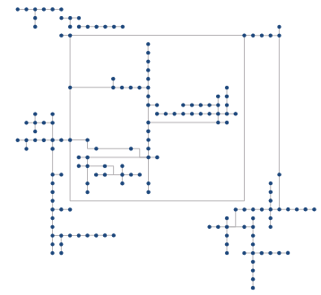

---
id: TopologicalTLogicSchema
title: 拓扑逻辑图  
---  
### 使用说明

拓扑逻辑图，是基于网络数据集生成体现自身逻辑结构的示意图，将复杂的网络以一种直观的方式进行表达，简化了网络的表现形式。

可应用于电信、交通、管线、电力等行业的资源管理，通过拓扑逻辑图查看网络，能够有效评估现有的网络资源分布，预测和规划后续资源的配置等。

SuperMap 支持根据网络弧段和网络结点表示的网络关系，构建拓扑逻辑图，方便检查网络连通性及获取网络数据的逻辑示意图。拓扑逻辑图支持三种布局，分别为树形图、等级图和正交直角图。

* 树形图和等级图都适用于类似有向的设施网络中，有明确的源的网络。如下图1网络中只有一个源，也就是一个子网中，只有一个入口，其他均为出口，这种网络可以生成树形图和等级图，如图2、图3;

* 对树形图，在一个子网中，只支持单源或单汇点情形，也就是一个子网中，只能有一个源点，汇点不做要求，如图2。也支持只有一个汇点，源点不做要求。

 |  |  
---|---|---  
图1：原始网络数据集 | 图2：树形图 | 图3：等级图  

* 相对于树形图，等级图排列更紧凑。但是树形图有其局限性，例如下图4网路中子网有无法构建树形拓扑图，每个子网不满足树形图的单源或单汇点的要求，但是，等级图可以很好处理，图5为该网络数据集的等级图：

 |   
---|---  
图4：原始网络数据集 | 图5：等级图  

* 直角正交图对数据要求比较少，算法是按等级顺序正交排列活动逻辑图中的结点要素和链接要素，要求数据不能有自循环（即在一条网络弧段中，起点等于终点）的弧段，如下图为正交直角图 。  

  

### 功能入口

* **数据** 选项卡- **拓扑** - **拓扑逻辑图** - **树形图/等级图/正交直角图** 。
### 参数说明

**树形图**

* **布局走向**
：树形图和等级图支持设置拓扑逻辑图的布局走向，图形走向布局包括：从左至右、从右至左、从上至下、从下至上四种方式，默认为从左到右。

* **从左至右** ：逻辑图将从左侧的根结点开始，并在右侧结束。

* **从右至左** ：逻辑图将从右侧的根结点开始，并在左侧结束。

* **从上至下** ：逻辑图将从顶部侧的根结点开始，并在底部结束。

* **从下至上** ：逻辑图将从底部的根结点开始，并在顶部结束。

* **层级距离** ：设置树形层级之间的距离，默认值为20，如下图所示从结点①到结点②为两个层级，dx即为层级间的距离。

* **打断比例**
：设置折线打断比例，默认值为50%，即在中间处打断。如下图所示从结点①到结点②的连接折线，即为要打断的折线，设置打断距离为70%，得到如图效果。

* **节点距离** ：设置拓扑逻辑图结点之间距离，默认值为20，如下图所示从结点①到结点②的结点距离为dy。

  

**等级图**

* **等级距离** ：设置拓扑逻辑图等级之间的距离，默认值为50，如下图所示从结点①到结点②为两个等级，dz即为等级间的距离。

  
 
* **光滑系数** ：设置光滑系数，如果需要对结果进行光滑处理，可以设置大于1的光滑系数，默认不进行光滑处理，即值为1。

