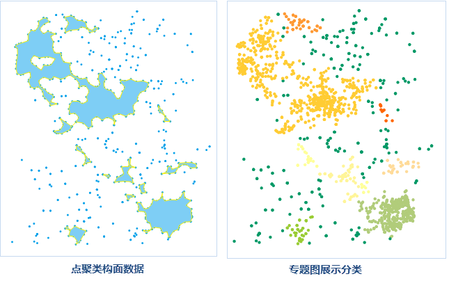

---
id: AggregatePoints
title: 点密度聚类  
---  
 ### 使用说明

点密度聚类功能是指根据密度聚类的算法，将空间位置分布较为密集的点划分为一簇，或将同一簇点构成一个多边形。点聚类之后会在源数据集中生成一个“ResultType”字段，用于统计聚类类别信息。

 ### 应用场景

 该功能适用于大数据量的数据，应用于根据点的空间关系的亲疏程度进行分类，去除噪声点，也可将地理位置较紧密的一簇点构建为面对象，具体应用场景如下：

   * 去除点云数据噪声点：在点云数据的获取时，会受到人为、仪器、环境、测量方法等因素的影响和干扰，获取到的点云数据中会含有噪声点。而获取到的被测物体的点云通常是沿表面连续分布的，噪声点一般位于点云外随机分布，因此，可通过点密度聚类功能，将噪声点去除。

   * 根据通讯信号的监测数据构建信号较弱的区域：通信监控系统会实时监控通讯信号的强度，可根据信号强弱情况，将信号低于某个强度的点提取出来，通过密度聚类功能构建信号较弱的区域，可作为新建信号塔选址的参考。

 ### 功能入口

   * **数据** 选项卡- **数据处理** - **矢量** - **点聚类** 。

   * **工具箱** - **数据处理** - **矢量** - **点聚类** 。(iDesktopX)

 ### 参数说明

 在“点密度聚类”对话框中设置如下参数：

   * **源数据** ：用于显示和设置要进行密度聚类的点数据集及其所在的数据源。

 **只处理选中对象** ：若选中了点数据集中的点对象，即可勾选该复选框，只对选中对象进行聚类。

   * **参数设置**

     * 聚类半径：设置点密度聚类的半径，表示指定半径范围内，点的数目大于等于阈值时，则表示这些点为一个类别，即新增的 ResultType
属性值一样。半径单位可单击右侧下拉按钮进行设置。

     * 点数目阈值：用于显示和设置聚类为一簇的最少点个数，该值必须大于或等于2。阈值越大表示能聚类为一簇的条件越苛刻。推荐值为4。

   * **结果数据** ：用于显示和设置结果数据集及所要保存在的数据源。

执行成功后，输出窗口会有相应的提示，并提示聚类类别保存在数据集的字段名，得到的聚类结果如下图所示。如图所示，不能构成面的点即为离散点（噪声点），即右图中深绿色的点，其ResultType 属性值为 0。   
  
     
 ---  
  
 ### 注意事项

 若勾选了“只处理选中对象”，则聚类后只会生成面数据集，不会在源数据集中增加分类字段。

