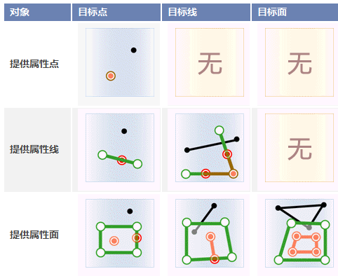
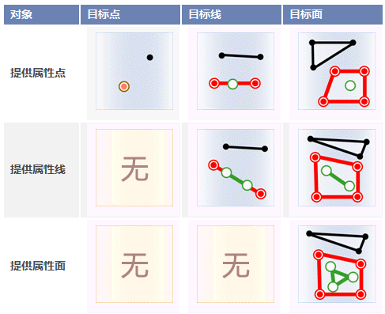
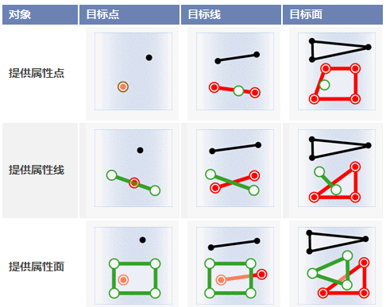

---
id: Attributeupdate
title: 数据集属性更新  
---  
### 使用说明

根据空间关系更新数据集中对象的属性。

“数据集属性更新”功能内提供了两种选择更新目标数据的操作方式，第一种是选择数据集按条件进行更新；第二种是在地图窗口中选中要更新的几何对象，然后勾选“仅对选中对象进行更新”，只针对选中的几何对象进行数据更新，（只能操作一个数据集中的几何对象）。

### 功能入口

* **数据** 选项卡- **数据处理** - **矢量** - **属性更新** ，弹出“属性更新”对话框。

* **工具箱** - **数据处理** - **矢量** - **属性更新** ，弹出“属性更新”对话框。(iDesktopX)

### 参数描述

* **提供属性的数据** ：在“ **属性更新** ”对话框“提供属性的数据”区域选择提供属性数据，有选择数据集和选中对象两种方式：在“
**数据源** ”和“ **数据集** ”处选择提供属性的数据集。若在工作空间管理器中选中了数据集，则会默认该数据集为提供属性的数据。

* **目标数据** ：在“ **目标数据** ”区域设置待更新的数据集及其所在的数据源：

    * 保存统计信息：统计满足源数据集与目标数据集中指定空间关系的几何对象个数，将该信息保存在目标数据集中的某个整型字段里。
    
    勾选“ **保存统计信息** ”然后选择一个字段用来存储更新对象的数量，建议用户新建一个字段来存储该信息以免破坏原有数据。

    * 过滤表达式：单击右侧按钮，在弹出的“[SQL表达式](../../Query/SQLDia)”对话框中设置字段过滤条件，更新属性时过滤掉目标数据集中符合表达式条件的对象，不将源数据集中的字段信息更新到这些对象属性中。

    * 选中对象：若在地图窗口中选中了几何对象，则“属性更新”对话框中会默认勾选“仅选中对象提供属性进行更新”复选框，表示只有选中的几何对象提供属性， **注意**：只能对一个数据集中的几何对象进行操作。

* **空间关系** ，空间关系是指提供属性几何对象相对于目标几何对象的空间关系，有 **“包含** ”， **“被包含** ”，“ **相交**”三种关系。“空间关系”说明如下：下图中绿色表示提供属性数据集中的对象，红色表示满足空间关系的目标对象，黑色表示不满足空间关系的目标对象。

    * **包含** ：提供属性数据集中几何对象包含目标数据集中几何对象。    
    
    

    * **被包含** ：提供属性数据集中几何对象被目标数据集中几何对象包含。   
    
       

    * **相交** ：提供属性数据集中几何对象与目标数据集中几何对象相交。     
            
    
 
* **边界处理** ：用于判定空间关系是否将面对象的边界归属于面内。可设置为面边界为面外、面边界为面内两种方式。

    * 该组合框只有在需要进行面与点的包含关系判定时，或面与线的相交关系判定时才会被激活。

    * 若选择“ **面边界为面内** ”，表示位于面边界上的点属于面所包含的点，线上的点与面相边界上的点重合时，表示面与该线相交。

    * 若选择“ **面边界为面外** ”，表示位于面边界上的点不算面所包含的点，线上的点只与面边界上点重合而不位于面内，此时不算相交。

* **取值方式** ，如果满足条件并可提供属性数据的对象有多个，则提供属性对象通过某种“取值方式”处理后赋给目标对象。

    * **直接赋值：** 随机取其中一个的属性数据用于更新。该方式适合一对一赋值。

    * **平均值：** 取其平均值用于更新。对数值类型的字段有效。

    * **求和：** 取各个对象的属性和用于更新。对数值类型的字段有效。

    * **最大值：** 取各个对象属性中最大的值用于更新。对数值类型的字段有效。

    * **最小值：** 取各个对象属性中最小的值用于更新。对数值类型的字段有效。

    * **最大SMID：** 取具有最大 SmID 的对象属性值用于更新。

    * **最小SMID：** 则取具有最小 SmID 的对象属性值用于更新。

* 在“ **字段设置**
”列表中勾选要进行数据更新的“源字段”，在对应的“目标字段”中选中后再次单击，就可以进行选择设置（选择需更新到的目标字段）。

**注意** ：支持跨字段类型存储更新结果，减少用户对更新结果的二次处理，同时支持新建目标字段进行属性更新。

* **忽略系统字段** ：复选框用于设置是否忽略系统字段，若勾选该复选框则字段列表中不显示系统字段，若不勾选则显示系统字段。

* 更新完成后，目标数据集属性表中的字段（新建或者已存在的字段）会更新源数据集中对应的字段值。

### 注意事项

* 在设置字段时，要求源字段与目标字段类型必须相同。字段类型不同无法进行赋值。

* 不同的统计方法需要对应不同的统计字段。直接赋值、最大 SMID 和最小 SMID
为数值类型或文本类型，不支持布尔类型、备注类型和日期类型。平均值、求和、最大值和最小值为数值型字段。

