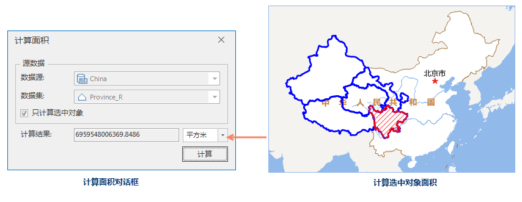

---
id: CalculateArea
title: 计算面积  
---  
 ###  使用说明

支持计算矢量面数据集的面积，可选中矢量数据集中的多个对象进行面积计算。同时支持设置计算单位，程序提供平方千米、平方米、公顷、公亩、顷、亩、平方英尺、英亩等十余种单位供用户换算选择。

 ### 功能入口

   * **数据** 选项卡- **数据处理** - **矢量** - **计算面积** 。

   * **工具箱** - **数据处理** - **矢量** - **计算面积** 。(iDesktopX)

 ###  参数说明

 在“ **计算面积** ”对话框，设置如下参数：

   * **选择计算面积的数据集** ：在“ **源数据** ”区域选择数据源及要计算面积的面数据集。

   * **只计算选中对象**
：支持用户选择数据集中的一个或多个对象进行面积计算，用户可在当前地图窗口打开数据集，选择参与面积计算的对象。该复选框只有在地图窗口已选择一个或多个矢量面对象时，才会被勾选。如该复选框未被勾选，则计算的是整个矢量数据集的面积。

   * **设置面积单位** ：默认计算面积的单位为“ **平方米** ”，可点击“平方米”右侧的下拉按钮，切换其他计算单位。

   * **计算** ：单击“ **计算** ”按钮，面积结果在“计算结果”框中显示。同时在输出窗口输出计算结果。
  
 ---  

 ###  注意事项

 “计算面积”对话框为非模态对话框，用户可以在打开该对话框后再进行打开数据集、选择对象等其他交互操作。

