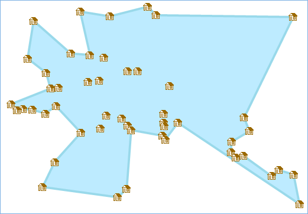

---
id: CalculateConcaveHull
title: 计算凹多边形  
---  
###  使用说明

凹多边形，是指一个多边形的所有边中，有一条边向两方无限延长成为一直线时，其他各边不都在此直线的同旁，那么这个多边形就叫做凹多边形，其内角中至少有一个优角（即大于180°而小于周角360°的角）。如下图1所示的凹多边形，其中∠ABC
为优角；延长 AB 线，该多边形其他各边不都在 AB 延长线的同旁。与凹多边形对应的另一类多边形为 **凸多边形**
，是指一个多边形的所有边中，任意一条边向两方无限延长成为一直线时，其他各边都在此直线的同旁，那么这个多边形就叫做凸多边形，其所有内角小于等于180度，任意两个顶点间的线段位于多边形的内部或边上，如下图2。

* 当需要用多边形表示一定区域的点位覆盖时，通常用凹多边形表示，因为凸多边形会包含更多的空白多余区域，凹多边形较凸多边形更能表达真实的点位分布。

  
---    

* 支持通过指定点集合或点数据集和凹多边形最小内角角度，计算指定点集中所有点对象的凹多边形。凹多边形最小内角影响生成凹多边形的面积大小，通常情况下角度越小面积越小。为得到包含指定点对象的最小凹多边形，并不是设置的角度越小越好，因为设置的角度越小，多边形越尖锐，并不能最优的反映真实的点对象分布。

  
---  

### 功能入口

* **数据** 选项卡- **数据处理** - **矢量** - **计算凹多边形** 。

* **工具箱** - **数据处理** - **矢量** - **计算凹多边形** 。(iDesktopX)

###  参数说明

* **选择点数据集** ：在“ **源数据** ”区域选择数据源及要计算凹多边形的点数据集。

* **只计算选中对象**
：只对点数据集中部分点对象计算凹多边形。该复选框只有在地图窗口已选择点对象时，会被默认勾选。如该复选框未被勾选，则计算的是整个点数据集的凹多边形。

* **角度** ：生成凹多边形内角的最小角度。可设置的角度有效范围为0°至180°之间（不包含0°和180°），程序默认为45°。

* **结果数据** ：在“ **目标数据源** ”设置存储多边形的数据源，数据集可选择数据源中已存在的目标数据集，也可支持在 **新建数据集**
处新建一个数据集。

完成参数设置，即可执行计算凹多边形的操作，执行完成后，将在当前地图窗口直接打开该数据。

**示例** ：某物流公司预根据包裹派送点位划分派送片区范围，选择包裹派送点数据集计算凹多边形，角度设置为45°，得到如下图结果：

  
