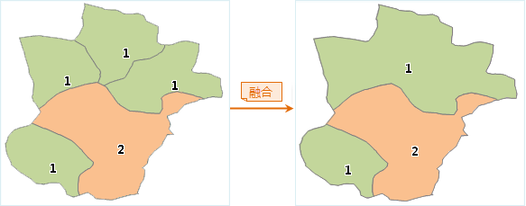
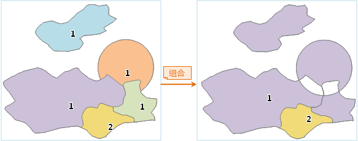

---
id: Datafuse
title: 数据集融合  
---  
### 使用说明

将一个线数据集、面数据集、文本数据集中符合一定条件的对象融合成一个对象。该功能的适用对象为二维线数据集、二维面数据集、三维线数据集以及文本数据集。

数据集融合时需要遵循如下条件：

* 数据对象间某字段的值相同。

* 线对象需端点重合才可以进行融合。

* 面对象必须相交或相邻（具有公共边）。

数据集融合功能中包括融合、组合、融合后组合三种处理方式。 **注** ：文本数据集融合默认只支持 **“组合”** 的处理方式

* **融合功能的效果如下** ：  
   

对编号为 1 的对象进行融合  

如上结果显示编号为 1 的地区被融合，但是不相邻的对象不进行融合。

* **组合功能的效果如下** ：   
   

编号为 1 的对象组合成一个复合对象  

如上结果显示组合是把多个子对象组成一个复合对象，其中对象的交集部分按照异或运算进行处理。

### 功能入口

* **数据** 选项卡- **数据处理** - **矢量** - **融合** 。

* **工具箱** - **数据处理** - **矢量** - **融合** 。(iDesktopX)

### 参数描述

* **源数据** ：显示了所选数据源下所有的线、面数据集。选择需要融合的数据集。

* **参数设置**

    * **融合模式** :系统提供了三种融合模式。

        * **融合** ：将具有相同属性字段值且相交或距离在融合容限范围内的对象融合成一个整体对象。

        * **组合** ：将具有相同属性字段值的对象组成一个对象，重叠部分进行删去处理。

        * **融合后组合** ：具有相同属性字段值且相交/相切的对象融合成一个简单对象，融合后若对象的融合字段值相同，将其组合成一个复杂对象。

    * **融合容限**：融合后若两个或多个节点之间的距离在此容限范围内，则被合并为一个节点。默认数值为数据集边界范围的一百万分之一（最大容限为默认容限的100倍），单位为数据集原有单位。  
    **注** ： 文本数据集融合时，只支持融合方式为组合，且融限不可设置（无意义）。  
    * **过滤表达式** ：只有满足此条件的对象才参加融合运算。  
    * **处理融合字段值为空的对象** ：选中此复选框，则融合字段值为空的对象参加融合运算。

* **结果数据** ：命名及保存融合结果数据集，并选择该数据集所在数据源。

* **融合字段** :数据集中具有相同字段值的字段。根据此字段的值进行数据的融合、组合。

* **统计字段** :对融合的对象进行字段统计(生成新的字段存储统计值)，统计类型可以是“ **最大值** ”、“ **最小值** ”、“**总和** ”、“ **平均值** ”、“ **第一个对象** ”、“ **最后一个对象** ”。

    * **最大值** ：对融合/组合对象求字段的最大值，只对数值型字段和时间型有效。

    * **最小值** ：对融合/组合对象求字段的最小值，只对数值型字段和时间型有效。

    * **总和** ：对融合/组合对象求字段的和，只对数值型字段有效。

    * **平均值** ：对融合/组合对象求字段的平均值，只对数值型字段有效。

    * **第一个对象** ：得到融合/组合对象中 SmID 最小的对象相应的字段值。

    * **最后一个对象** ：得到融合/组合对象中 SmID 最大的对象相应的字段值。

### 注意事项

* 融合字段值相同的情况下，有三条（或以上）线段的端点重合于一点时，系统将不进行融合。

