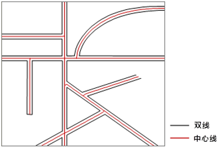

### 使用说明

双线提取中心线是指根据给定的宽度从非闭合的双线中，提取两条线之间的中心线，并将结果保存为线数据集。双线提取中心线多用于道路线数据，双线平行或近乎平行时，提取效果较好。

### 操作步骤

1. 在当前工作空间中添加有线数据集的数据源。
2. 在功能区“ **数据** ”选项卡的“ **数据处理** ”组的 Gallery 控件中，单击“ **双线中心线** ”下拉按钮，选择“ **双线提取中心线** ”按钮，弹出“ **双线提取中心线** ”对话框。
3. 在“ **源数据** ”区域选择数据源及要提取中心线的线数据集。
4. 在“ **结果数据** ”区域中设置结果数据存放的数据源及数据集名称，默认将结果数据集命名为“CenterLineResult”。
5. 用户需在“ **参数设置** ”处设置提取的最大宽度和最小宽度。

    * **最大宽度** ：需提取中心线的双线间最大宽度值（大于0），默认值为30，单位与源数据集相同。用户可通过“ **地图** ”选项卡“ **量算** ”组中的“ **距离** ”选项，量算双线的最大宽度。建议用户设置的最大宽度略大于实际量算的距离，这样提取的结果会更准确。 
    * **最小宽度** ：需提取中心线的双线间最小宽度值（大于或等于0），当双线间距离小于最小宽度时，不提取该处中心线，默认值为0，单位与源数据集相同。

**注意**
：最大最小宽度与源数据集单位一致。最大宽度必须大于0，且必须设置最大宽度。双线宽度在最大和最小宽度之间时会提取其中心线；双线宽度小于最小宽度时不提取中心线；双线宽度大于最大宽度时提取其边界线。

  6. 单击“确定”按钮即可进行提取，提取到的中心线数据集属性表中，会保留源双线数据的属性信息，字段名称会通过L和R区分中心线左右两边的线对象。    

### 注意事项

  * 该功能适用于非封闭的线数据集，若双线是封闭的，需先将双线某个端点打断，留一个开口。
  * 双线间最大宽度的设置会影响结果数据的准确性，用户需准确输入最大宽度值。
  * 对于双线道路中比较复杂的交叉路口，如立交桥、五叉六叉等情况，提取的结果可能不理想。

