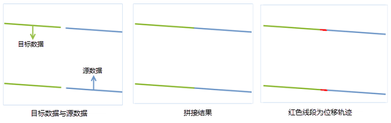

### 使用说明

图幅接边是指将相邻图幅的边缘线对象进行衔接，在分幅编绘、测绘地图后，再将地图拼接成一幅图时，通常会存在图幅边缘对象不衔接的问题，可通过该功能将线对象进行接边。

该功能适用于二维线数据集，图幅接边方式有向一边接边、中间位置接边、交点位置接边三种。

### 操作步骤

  1. 在“ **数据** ”选项卡的“ **数据处理** ”组的 Gallery 控件中，单击“ **图幅接边** ”按钮，弹出“图幅接边”对话框。

  2. **设置源数据** ： 设置源数据集及其所在的数据源，源数据数据集的坐标系需与目标数据集坐标系一致。

  3. **设置目标数据** ： 设置目标数据集及其所在数据源，需注意的是图幅接边将直接修改目标数据集，建议在进行该操作前对目标数据集进行备份。

  4. **接边参数设置** ： **接边模式** ：用于设置接边模式，应用程序提供了三种接边模式，具体说明如下：

  * **向一边接边** ：接边连接点为目标数据集中接边关联记录的端点，源数据集中接边端点将移动到该连接点上。
  * **中间位置接边** ：接边连接点为目标数据集和源数据集接边端点的中点，源数据集和目标数据集中的接边端点将移动到该连接点。
  * **交点位置接边** ：接边连接点为目标数据集和源数据集中接边端点的连线和接边线的交点，源和目标数据集中接边端点将移动到该连接点。

      **接边线** ：若接边模式设置为“交点位置接边”，则可勾选“接边线”复选框，通过选择线或绘制线的方式，确定接边的交点。

      **接边容限** ：用于设置源数据与目标数据中线接边的容限值，若线对象相邻端点之间的距离在此容限范围内，则认为这两条线是相接的。容限默认值为
      1，单位与源数据集的坐标单位保持一致。

      **接边融合** ：勾选改复选框表示将接边关联的源数据对象和目标数据对象融合，源数据的其他对象追加到目标数据中。

      **属性保留** ：支持设置保留参与接边融合对象的属性值，可选择保留非空属性、源字段属性或目标字段属性。

    * **非空属性** ：保留源数据和目标数据接边对象中非空的属性值。若源数据与目标数据接边对象均为非空属性，则保留源数据接边对象的属性值。
    * **源字段属性** ：保留源字段的属性值。
    * **目标字段属性** ：保留目标字段的属性值。

  5. **接边关联数据** ：勾选该复选框，可将接边辅助线保存为线数据集，该辅助线描述了源数据和目标数据在进行接边时对象端点的处理轨迹，支持设置该数据集的名称及其所在的数据源。
  6. 设置好以上参数后，单击“确定”按钮就可执行图幅接边操作，拼接结果如下图所示：  
  
  

### 注意事项

  1. 源数据集和目标数据集的坐标系相同，才可进行接边处理。
  2. 若选择“交点位置接边”方式进行接边，但两图层中的线对象没有交点，且没有绘制或选择接边线，则应用程序会按“向一边接边”的方式进行接边。

