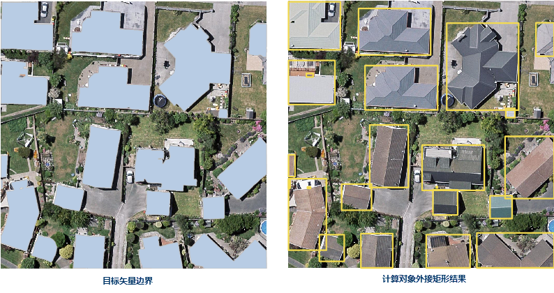

---
id: ObjectEnvelope
title: 对象外接矩形  
---  
### 功能说明

对象外接矩形是为线数据集或面数据集中的对象创建外接矩形，生成一个新的面数据集，并将对象的属性信息赋予生成的面对象。

 |   
---|---  
线数据集生成外接矩形示意图 | 面数据集生成外接矩形示意图  

### 应用场景

可应用于 AI 遥感影像信息提取中，为目标检测训练样本数据提供兴趣目标矢量边界的外接矩形，便于建筑物、耕地等信息的提取。

### 功能入口

* **数据** 选项卡- **数据处理** - **矢量** - **对象外接矩形** 。

* **工具箱** - **数据处理** - **矢量** - **计算外接矩形** 。(iDesktopX)

### 参数说明

* **源数据** ：选择待分析的数据集，仅支持线数据集和面数据集，不支持点数据集。

* **拆分子对象** ：当数据集中的对象为复合面对象、或复合线对象时，支持设置是否将其拆分为子对象。

* 若勾选该复选框，则将复合对象拆分为多个子对象，为每个子对象都生成一个范围面;

* 若不勾选该复选框，则将复合对象作为一个对象生成范围面。

* **结果数据** ：结果数据集为面数据集，源数据对象的属性将保留在结果数据集对应的面对象中。

### 应用示例

目标检测训练过程需要兴趣目标的矩形框作为标签，利用计算外接矩形功能，计算兴趣目标矢量边界的外接矩形，为目标检测训练数据生成准备标签数据，得到如下图所示的结果：

 