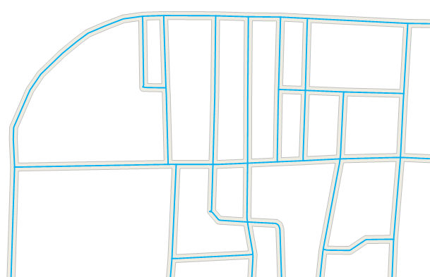

---
id: RegionToCenterLine
title: 面提取中心线  
---  
### 使用说明

面提取中心线是指提取面数据集中所有面对象的中心线，并将结果保存为线数据集，一般用于提取道路面的中心线。

### 功能入口

* **数据** 选项卡- **数据处理** - **矢量** - **面提取中心线** 。

* **工具箱** - **数据处理** - **矢量** - **面提取中心线** 。(iDesktopX)

### 参数说明

在“双线提取中心线”对话框中设置如下参数：

* **源数据** ：选择数据源及要提取中心线的面数据集。   
若未勾选“只提取选中的面对象”复选框，则会提取数据集中所有面对象的中心线，同时可重新指定需提取中心线的面数据集和所在数据源。  
若勾选了“只提取选中的面对象”复选框，则只会提取选中对象的中心线，数据集和数据源不可修改。

* **结果数据** ：设置结果数据存放的数据源及数据集名称，默认将结果数据集命名为“CenterLineResult”。

* 在“ **参数设置** ”处设置提取的最大宽度和最小宽度：

    * **最大宽度**：需提取中心线的面对象边界线之间最大宽度值（大于0）。当面对象边界线之间距离大于最大宽度时，提取该处边界线，默认值为30，单位与源数据集相同，最大宽度应大于最小宽度。用户可通过“地图”选项卡“量算”组中的“距离”选项，量算面对象的最大宽度。  
    **建议** ：设置的最大宽度可略大于实际量算的距离，这样提取的结果会更准确。  
    * **最小宽度**：需提取中心线的面对象边界线之间的最小宽度值（大于或等于0），当面对象边界线之间距离小于最小宽度时，不提取该处中心线，默认值为0，单位与源数据集相同，最小宽度应小于最大宽度。

**注意** ：面对象宽度在最大和最小宽度之间时会提取其中心线；面对象宽度小于最小宽度时不提取中心线；面对象宽度大于最大宽度时提取其边界线。

设置好结果数据集之后，即可执行提取中心线操作，结果如下图所示， 结果数据集属性表中，会保留源面对象的属性信息，便于用户查看对比。

  

### 注意事项

* 面对象边界线间最大、最小宽度的设置会影响结果数据的准确性，用户需准确输入最大、最小宽度值。

* 对于道路中比较复杂的交叉路口，如立交桥、五叉六叉等情况，提取的结果可能不理想。

