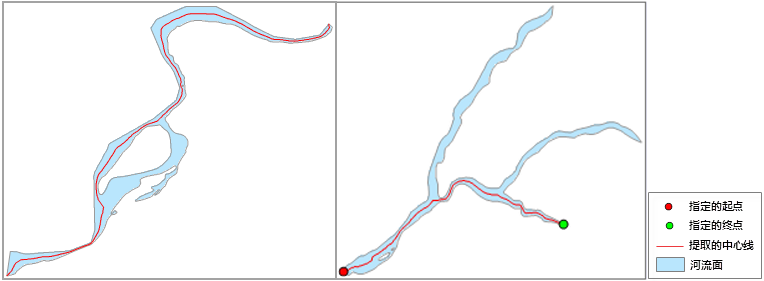

---
id: RegionToCenterLineMain
title: 面主干中心线  
---  
### 使用说明

面主干中心线是指提取面数据集主干道面对象的中心线，即按面对象的最长距离进行提取，并将结果保存为线数据集，一般用于提取河流的主干中心线。

提取中心线时，默认按面对象的最长距离提取；同时，还可支持单独提取某个选中面对象的中心线，若提取的中心线范围未达到用户需求，可指定提取中心线的起点和终点。如果面对象中包含岛洞，提取时会绕过岛洞，并选择一条最短路径提取中心线。

### 功能入口

* **数据** 选项卡- **数据处理** - **矢量** - **面主干中心线** 。

* **工具箱** - **数据处理** - **矢量** - **面主干中心线** 。(iDesktopX)

### 操作步骤

提取面数据中心线前，可以选择数据集中的面对象，也可不选中面对象，对整个数据集进行提取。

* 在“ **源数据** ”区域会显示要提取中心线的数据集及所在数据源。  
若未勾选“只提取选中的面对象”复选框，则会提取数据集中所有面对象的中心线，同时可重新指定需提取中心线的面数据集和所在数据源。  
若勾选了“只提取选中的面对象”复选框，则只会提取选中对象的中心线。数据集和数据源不可修改，同时可指定提取的起点与终点。
* 在“ **结果数据**”区域中设置结果数据存放的数据源及数据集名称，默认将结果数据集命名为“CenterLineResult”。勾选“在地图中显示”复选框后，提取出的结果数据会直接在当前地图中显示。

* 在“ **被选对象提取设置** ”处，可勾选“指定起点与终点”复选框，单击右侧按钮，在数据集选中对象中选择起点和终点，作为提取的参考点，或者分别在“起点X”、“起点Y”、“终点X”、“终点Y”文本框中，直接输入起点和终点的坐标，指定提取的起点和终点。提取的中心线可能不会严格从指定的起点出发，到指定的终点结束，系统一般会在指定的起点和终点的附近，找到一个较近的点作为提取的起点或终点。

**注意** ：只有在用户勾选了“只提取选中的面对象”情况下，才可指定起点与终点来提取。

* 设置好参数之后，即可对指定的区域进行提取，并查看提取结果。

  

### 注意事项

* 如果将起点和终点指定为相同的点，即等同于不指定提取的起点和终点，则提取的是面对象的最长的一条中心线。

* 如果指定的起点或终点在面对象的外面，则“输出窗口”会提示用户提取失败。

* 一个面对象按最长距离只提取一条中心线，如果提取的不是期望的中心线，可以指定起点和终点来提取。

