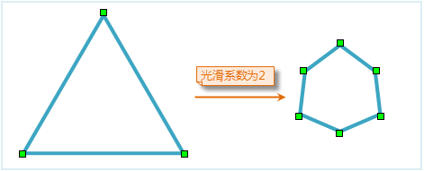
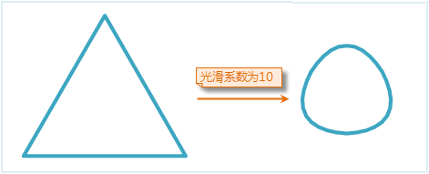
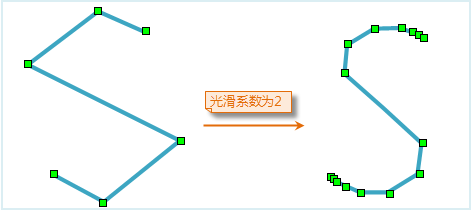
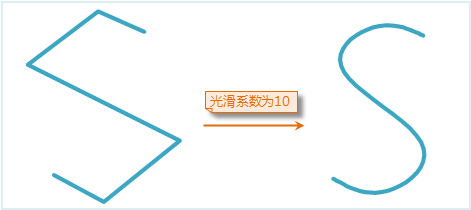
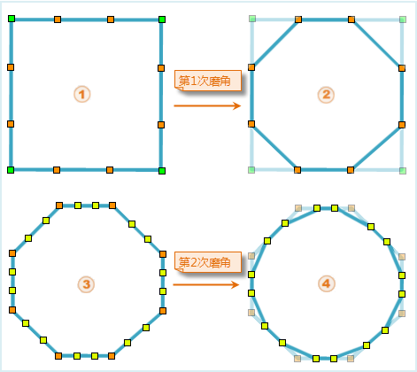

当前 SuperMap UGC(Universal GIS Class)系列产品中针对线、面数据集提供的光滑处理方法主要有B样条法和磨角法两种方法。

### 一、使用 **B 样条法进行光滑处理**

光滑系数是控制光滑度的参数， 在 B 样条法中也可以理解成线段上两个节点之间插入点后分隔的段数。

对非闭合线段进行光滑处理时要尽量保持原来曲线的形状，为了实现此目标通常采用的方法是：首、末两端点位置保持不变，增加首、末两端线段插入点后分段的数目（通常是光滑系数的二倍）。

设置光滑系数，取大于等于 2 的值有效，该值越大，线对象或面对象边界的节点数越多，也就越光滑。建议取值范围为[2,10]。

B 样条法插点数目计算方式分为闭合线和非闭合线两种：

* 如果线段闭合，最终节点数目=(控制点数目-1)*光滑系数+1
* 如果线段非闭合，最终节点数目=（控制点数目+1）*光滑系数+1
* 控制点可以理解为光滑前线对象上实际的节点数目。

  1. 下面所示的是闭合线进行光滑时候的插入点情况。（注意闭合曲线的实际点数比显示的少一个，因为在第一个点与最后一个点的位置是重合的）

对闭合线进行光滑处理时光滑系数设置为 2，即每段之间插入 1 个点使其分隔成 2 段从而实现光滑。

光滑前4个点，光滑后7个点。

对闭合线进行光滑处理时光滑系数设置为 10，光滑效果如下。

  2. 下面所示的是非闭合线进行光滑时候的插入点情况。

对非闭合线进行光滑处理时光滑系数设置为 2，即中间每段之间插入 1 个点使其分隔成 2 段从而实现光滑，首末两端段数分隔成 4 段（插入 3 个点）。

光滑前6个点，光滑后15个点。

对非闭合线进行光滑处理时光滑系数设置为 10，光滑效果如下。

### 二、磨角法进行光滑处理

磨角法是一种运算相对简单，处理速度比较快的光滑方法，但是效果比较局限。它的运算过程主要是先对两节点之间的线段插入两个点，即三等分原有线段，然后原有节点两边相邻的插入点进行连线，从而抹去原有几何对象中节点所在的角，完成一次以上过程为一次磨角过程。

其中光滑系数指的是磨角的次数，光滑系数值越高，获得结果对象中插入点也越多，结果也就越接近光滑。

  1. 下面是用磨角法对封闭四边形进行光滑处理的过程，光滑系数是 2 即进行两次磨角处理。

  2. 非闭合线进行磨角光滑处理时中间线段和节点处理过程同上，首末两个端点保持位置不变。

  

