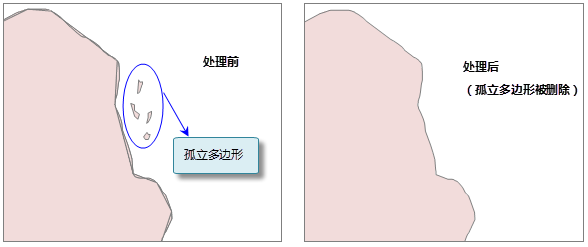

---
id: UnionPieces
title: 碎面合并  
---  
### 使用说明

将面积较小的多边形合并到大面积的多边形上。

在数据制作和处理过程中，很可能产生一些细碎的多边形，称之为碎多边形。可以通过“碎多边形合并”功能将这些细碎多边形合并的相邻的大多边形中，或者将孤立的碎多边形删除（孤立碎多边形没有与其他多边形邻近或者相切，不容易合并），以达到简化数据的目的。

一般来说，面积远远小于数据集中其他面对象的多边形才可以认为是“碎多边形”，通常是同一个数据集中面积最大的多边形面积的百万分之一到万分之一之间，但在实际操作中可以根据实际的需求设置合适的最小多边形容限。节点捕捉容限是用来判断多边形是否邻接。如果对相离的面对象设置了较大的容限或者对实际上邻接的多边形设置过大的容限都是不合理的，都可能导致碎多边形合并失败。

如下图所示是一个面数据进行“碎多边形合并”处理后的结果。图2是碎多边形合并到相邻的大多边形中的效果。

 |   
---|---  
图1：碎多边形合并前 | 图2：碎多边形合并后  

对于面积小于指定的最小多边形容限的孤立多边形，选择了“删除孤立多边形”的效果如图3所示：

  

### 功能入口

* **数据** 选项卡- **数据处理** - **矢量** - **碎面合并** 。

* **工具箱** - **数据处理** - **矢量** - **碎面合并** 。(iDesktopX)
### 参数说明

在“ **碎多边形合并**
”对话框中，通过工具栏添加要进行碎多边形合并处理的数据集并且可以进行统一赋值。在列表框中设置相关参数，包括节点捕捉容限、最小多边形面积、删除孤立小多边形。

* **节点捕捉容限**：若两个节点之间的距离小于此容限值，则合并过程中系统会自动将这两个节点合并为一个节点。默认容限值与数据集的坐标系有关，具体说明请参见[容限说明](../Tolerance.html)。

* **最小多边形面积**：小于此面积值的多边形才作为碎多边形予以合并。系统会根据添加的数据集自动设置最小多边形面积字段值为该数据集最大对象面积的百万分之一，用户可以重新设置该字段值，建议输入该字段值的范围为该数据集最大对象面积的百万分之一至万分之一。如果超出该范围，则会在此字段最左边出现数值超出范围的红色标记，双击此标记，可以查看最小和最大值。不过也可以输入一个不在此建议范围内的数值，系统会合并小于此面积的多边形。

* **删除孤立多边形** ：选中某数据集中此复选框，则若遇到孤立的多边形（没有与其他多边形相交或者相切），系统会自动删除这些多边形。

