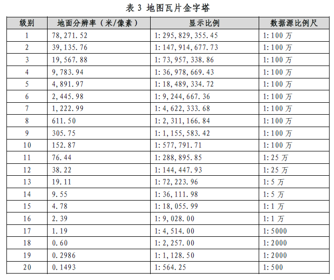
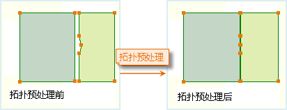

### 使用说明

当对象节点过于密集时，重新采集坐标数据，可按照一定规则剔除一些节点，以达到对数据进行简化的目的。数据集重采样支持线、面、网络数据集，同时可批量处理多个数据集。

### 操作步骤

1. 在功能区“ **数据** ”选项卡的“ **数据处理** ”组的 Gallery 控件中，单击“ **矢量重采样** ”按钮，弹出“ **矢量数据集重采样** ”对话框。 
2. 在左侧列表框中添加要进行重采样处理的数据集，通过工具可进行“添加”、“全选”、“反选”、“移除”的操作。
3. 在" **参数设置** "区域设置重采样的方法以及相关参数。 
* **重采样方法** ：应用程序提供了两种重采样的方法供用户选择，分别是：“光栏法”、“道格拉斯-普克法”。若想了解具体运算方式可以参照文档中 [线状对象重采样说明](../Objects\\EditObjects\\ReSampleIntro.htm) 页面的描述。
* **重采样距离** ：是指重采样的容限，重采样距离越大，采样结果数据越简化。支持以下两种方式是指重采样距离： 
* 根据比例尺：单击下拉按钮，可根据显示比例尺对应的分辨率距离设置重采样距离，该距离标准出自“2011地理信息公共服务平台电子地图数据规范”，具体标准如下图所示：    
* 自定义：用户可根据实际需求在数值框中输入重采样的距离，单位为米。

**注意** ：重采样距离应大于0.0000000001，小于数据集范围的1/10。

* **保留小对象** ：“小对象”是指重采样后的几何对象的面积为 0 的面对象，“保留小对象”操作只对面对象起作用；勾选该设置后，则会恢复重采样后面积为 0 的“小对象”的边界。
4. **拓扑预处理** ：勾选该选项，设置“节点捕捉容限”，对复杂面数据集进行拓扑预处理。对数据集进行重采样时，线数据集和网络数据集不需要进行拓扑预处理，面数据集可以选择是否进行拓扑预处理。进行拓扑预处理可以保持面数据集的拓扑关系，以保证对公共边界进行重采样时不会出现缝隙。 

在 SuperMap 应用程序中，“节点捕捉容限”的默认值与数据集的坐标系有关，具体说明请参见[容限说明](../Tolerance.htm)。

该功能主要处理相交或相邻的面几何对象；相邻（相交）边界两边有不同数量节点，且节点到邻近边界的垂直距离小于“节点捕捉容限”的时候，对边界两边进行位置合并，且通过增加节点方式统一相邻（相交）两边节点数量。

  

由于此操作直接在被操作数据集中进行，信息提醒按钮 
会提示用户，该操作会修改参与重采样的数据集。用户若不想修改源数据，请在拓扑预处理之前进行数据的备份工作。

5. 结果数据集：勾选该复选框则表示将重采样的结果数据集另存，设置结果数据保存的数据源和名称即可；若不勾选该选项则表示在源数据上进行重采样，建议事先对数据集进行备份。
6. 单击“确定”按钮执行矢量数据集重采样操作，单击“取消”按钮关闭窗口放弃操作。

