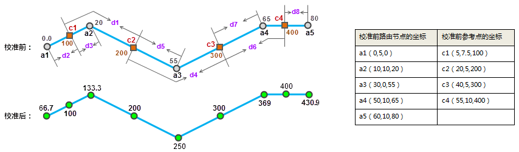

校准路由有利于保证测量值的正确性，从而保证事件被精确定位。使用可靠的参考点数据对路由数据的刻度值进行校准，是动态分段的重要步骤。例如，高速公路的路由数据，其刻度值为高速公路的里程信息，但是可能不够准确。经过测量人员的重新采集，沿高速公路每隔200米采集一个点，并通过仪器测量和记录对应的里程数。新采集的这批数据可以作为参考点数据，对已有的高速公路路由数据进行校正，以保证后续的动态分段结果的准确性。

###  校准路由的过程

校准路由是由读取参考点的刻度值来调整路由的刻度值的过程。校准路由过程说明如下：

  1. 通过路由标识字段将参考点和路由一一对应起来。参考点数据和路由数据分别有一个路由标识字段，与路由数据标识 ID 相同的参考点，视为与路由对应的参考点。
  2. 当对应参考点落在路由并与某一节点重合时，该节点的 M 值使用该参考点的 M 值。
  3. 路由上未与对应参考点重叠的节点的 M 值，使用位于校准容限范围内的参考点的 M 值插值获得。
  4. 位于校准容限范围之外的参考点将不参与校准。

  

###  校准方式

应用程序提供了两种校准方式：按距离校准和按刻度校准。

* **按距离校准**

基于两点间的沿路由的距离来计算 M 值。按距离校准的方式可以得到单调的校准结果，即校准后的 M 值是递增或者递减的。

 
  
按距离校准步骤如下：

  1. 对于节点a1，使用c1和c2来校准。首先计算c1与c2之间的距离d1，然后计算出校准率R1=d1/（200-100）。注意这里提到的距离都是指沿线距离。
  2. 然后计算a1和c1间的距离d2，那么有d2/（100-Ma1）=R1，则a1校准后的M值为100 - d2/R1。
  3. 同理，使用c1和c2来校准a2。先计算c1与a2间的距离d3，然后计算校准率R2=d1/（200-100），那么有d3/（Ma2-100)=R1，则a2校准后的M值为：100+d3/R1。
  4. 依次类推，使用c2和c3来校准a3，使用c3和c4来校准a4和a5。注意，校准率总是采样离被校准点最近的两个参考点来计算。
  5. 校准后路由各节点的M值，如上校准后的图所示。
* **按刻度校准**

利用参考点对应路由位置上的刻度值进行校准。这种校准方式能够保持原始路由数据刻度值的变化规律（如递增、递减或跳跃式变化）。在当被校准的路由长度与刻度值的比值不同时，此种方式非常适用于对路由的刻度值进行微调。

 

按刻度校准步骤如下：

  1. 使用参考点c1和c2来校准节点a1。首先计算M值校准率R1=（37.5-10）/（200-100），其中（37.5-10）称为c1和c2所在点在原来线上的线标差。
  2. a1和c1之间准确的线标差为（10-0），那么有（10-0）/（100-Ma1）=R1，则a1点校准后的M值为100 - （10-0）/R1。
  3. 同理，使用c1和c2来校准a2。首先计算校准率R2=（37.5-10）/（200-100），a2与c1之间准确的线标差为（20-10），那么有（20-10）/(Ma2-100)=R2，则a2点校准后的M值为100+（20-10）/R2。
  4. 以此类推，依次校准其余节点：使用c1和c2校准a2，使用c2和c3校准a3,使用c3和c4校准a4和a5。注意，校准率总是取离被校准最近的两个参考点来计算。
  5. 校准后路由各节点的M值，如上校准后的图所示。

###  备注

校准路由的两种校准方式都要求用于校准路由的参考点至少为2个，并且校准时，都采用离待校准节点最近的两个参考点来校准。
