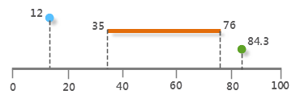
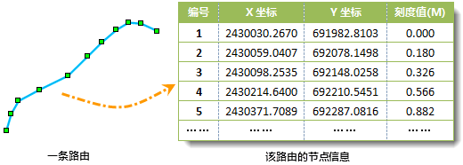
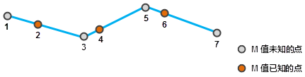

###  线性参考

线性参考是一种采用沿具有测量值的线性要素的相对位置描述和存储地理位置的方法。距离测量用于定位沿线事件，可以是长度、时间、费用等属性。线性参考技术作为一种常用的动态定位技术，广泛应用于公路、铁路、河流等线性特征的数据采集、公共交通系统管理、路面质量管理以及通讯和分配网络(如电网、电话线路、电视电缆、给排水管)模拟等领域。

现实生活中，人们基于以下两点原因，更倾向于采用线性参考技术：

  1. 现实生活中，我们常采用以沿线要素距离的方式定位，这比传统的精确（X,Y）坐标定位的方式更符合人们的习惯。比如在某某路口东300米处发生交通事故，比描述为发生在（6570.3876,3589.6082）坐标处更容易定位。
  2. 线性参考可用于多个属性表与线性要素的关联，不需要在属性值发生变化时分割线数据。

如下图所示，灰色的直线表示具有测量值的高速公路的里程数，线上方的点和线段代表了发生在该线段上的两类事件。描述如下：在高速公路12和84.3公里位置分别发生两起交通事故，而在沿高速公路35至76公里处由于暴雨侵袭发生路面坍塌。

  
 
###  动态分段

动态分段（Dynamic Segmentation）不是在线状要素沿线上某种属性发生变化的地方进行物理分段，而是在传统的 GIS 数据模型的基础上利用线性参考技术，将属性和它对应的线状要素位置存储为独立的事件属性表（事件表），在分析、显示、查询和输出时，直接依据事件属性表中的距离值对线性要素进行动态逻辑分段，动态的计算出属性数据的空间位置。

简单的说，动态分段是在地图上动态显示线性参考要素的过程，是线性参考技术的应用。它在不改变要素原有空间数据结构的条件下，建立线性要素上任意路段与多重属性信息之间关联关系。

###  基本概念

在 SuperMap 中，动态分段主要涉及两种数据结构：路由和事件表。路由用来表达具有测量值的线对象，事件表记录发生在路由上的现象的位置和其他属性。

* **路由**

路由就是任何具有唯一标识 ID 和度量系统的线性要素，可以是公路、街道、河流或管道等线状要素。路由上的每一个节点有个刻度值（M
值），表示了当前节点到起点的距离。

* **刻度值**

又叫 M 值，是指路由上一点的刻度值，表示该点到起点之间的距离。它独立于要素类的坐标系统，并不要求和要素类的坐标系统具有相同的单位。

  

* **路由位置**

路由位置是路由上一个“点”或者一段“线”。点的路由位置用点所在路由的标识字段和一个刻度值（M
值）来描述，线的路由位置用该线段所在路由的标识字段、起始刻度值(M 值)、终止刻度值（M 值）来描述。

* **路由数据集**

存放线类型数据的一种数据类型，线对象的每个节点除了有地理坐标值，还有一个刻度值（M
值），代表该节点到起点的距离。可以通过线及线上的点数据联合生成路由数据集。

* **事件**

以属性表形式存储的发生在路由系统中的系列点或线要素称为路由事件，它记录了点或线的所在路由的标识，对应的M值以及相关联的属性。路由事件简称事件，一般事件分为点事件和线事件两种类型。事件存储在事件表中。

* **点事件**

点事件对应路由上的一个精确位置点，如公路上的里程点、铁路上的交通事故发生点。

* **线事件**

线事件对应与路由上的一段，如道路维护中的某一段道路。

* **零长度事件**

指起始刻度与终止刻度相同的线事件。

* **事件表**

事件表包含了事件发生的条件、属性以及沿路由发生的事件的信息，将以上这些关联的属性存储到一个表中，就构成了一个路由事件表，简称事件表。同样事件表依据事件的不同可以分为点事件表和线事件表。

* **插值求 M 值**

通过外部数据或路由对象本身已知的刻度值，可以利用插值方法来估算路由上其他节点的刻度值。插值方法分为 **内插** 和 **外推** 两种。

内插即在数列的已知值之间估计中间各点的值，而外推即估算数列已知数值范围以外的各个值。如下图所示，节点1的 M 值可由点2、4通过向前外推得出，节点3和5的 M 值可由点2、4、6进行内插获得，节点7的 M 值则可以由点4、6通过向后外推得出。  

  
