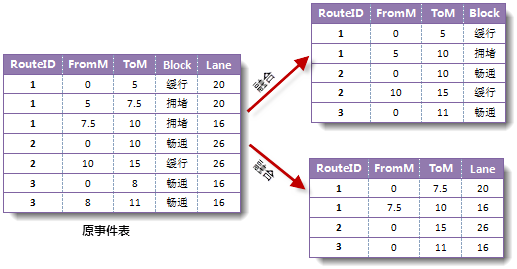

除了显示和创建事件表外，SuperMap 动态分段支持事件表分析功能，包括事件的叠加和融合。

###  事件表叠加

事件表的叠加需要输入两个事件表，将第一个事件表中的所有事件（称为输入事件）分别与第二个事件表中的所有事件（称为叠加事件）进行求交或求并的操作，结果会生成一个新的事件表。叠加的前提是输入事件和叠加事件具有相同的路由 ID，也就是说，具有相同路由 ID 的输入事件和叠加事件进行叠加才能产生结果。

对叠加后的结果事件表进行分析，可以帮助我们解决一些传统空间分析技术不能解决的问题。例如，在一份交通事故数据中，有两个事件表分别记录了事故发生时的路面宽度（Lane）和车速（Speed），将这两个事件表进行叠加求交，结果事件表中则是同时记录了路宽和车速两个信息的交通事故事件。从结果事件表中，可以快速获知交通事故的综合信息，如发生在路面宽度小于10米，且事故发生时车速大于70km/h 的交通事故有哪些。如果是叠加求并，则可用于查找路面宽度小于10米，或车速大于70，以及宽度小于10米且车速大于70的交通事故事件。

事件表叠加有两种方式：事件求交和事件求并。

* **事件表求交** ：事件表叠加求交方式会将具有相同路由 ID 的事件在交叠处进行分割，并输出到结果事件表中。
* **事件表求并** ：事件求叠加求并方式较为复杂，首先计算出事件的交集，输出到结果事件表中，然后使用交集对所有事件（包括输入和叠加事件）进行分割，将处于交集范围外的事件和写入结果事件表中。

事件表的叠加支持线线叠加（两个线事件表进行叠加），点线（线点）叠加（一个点事件与一个线事件叠加）和点点叠加（两个点事件叠加）。由于点点叠加在实际应用中很少用到，所以这里只介绍点-线叠加和线-线叠加。

* **线-线叠加**

线线叠加的结果为一个新的线事件表。下图为线线叠加的示意图，在这里输入事件与叠加事件具有相同的路由
ID。需要注意，一个输入线事件与一个叠加线事件成首尾相连状态时（如下图中的事件 a 与 A），会产生一个零长度事件，此事件的起始刻度值和终止刻度值相等。

  

* **线-点叠加**

将线事件表和点事件表叠加。叠加求交的过程会生成一个点事件表。注意：在进行事件表叠加时，如果其中一个事件为点事件，则输出事件必为点事件表。点线叠加与线点叠加的结果事件表类型相同。而叠加求并的过程会产生一个线事件表，同时在点事件和线事件相交处会生成零长度事件表。

下图为一个点事件表和一个线事件表叠加的示意图。在叠加求交时，得到点事件。在叠加求并时，点事件与线事件的相交处会产生零长度事件，如下图中的点事件2与线事件 a
叠加产生零长度事件 2a。

  

###  事件表融合

1. **事件表融合介绍** 事件表的融合是指对一个事件表进行的操作，将具有相同路由 ID
和融合字段值（该值用于标识哪些事件可以融合，具有相同融合字段值的事件才能融合）按照一定方式进行合并，可以达到去除冗余信息或依据不同属性信息对事件表进行拆分的目的。
   * 使用事件表融合去除冗余数据。  如下图所示，在一份高速公路限速事件表中，使用 Speed
字段记录了不同路段的最高限速值，其中相邻的路段可能限速相同，但却使用了两个事件来表示，造成了数据的冗余。这时就可以通过连接的方式对事件表进行融合以去除冗余的事件。同样，如果这些事件在位置上有交叠，也可通过交叠的方式进行融合以去除多余的数据。   
   * 使用事件表融合拆分事件表。  事件表中可能使用多个属性字段记录了事件的多个特性，通过指定不同的融合字段，对事件表进行多次融合，可以将一个事件表按照不同描述属性拆分为多个事件表。如下图所示，在一份交通状况事件表中，分别使用 Block 和 Lane 字段记录了不同路段的路宽和某一时刻的道路拥堵状况。可以分别指定 Block 和 Lane 字段为融合字段，对该事件表进行两次融合，可以将其拆分出两个事件表，一个描述某时刻道路的拥堵状况，一个记录了道路的宽度。    
  
2. **融合事件的方式**  事件表的融合有两种方式，分别是连接和交叠。
  * **连接** ：将两个具有相同路由 ID 和融合字段值，并且首尾相连的事件合并为一个事件写入结果事件表中。
  * **交叠** ：将两个具有相同路由 ID 和融合字段值的事件的交叠部分作为结果事件写入结果事件表中。

事件表的融合支持线事件融合和点事件表融合。下图所示是事件表的连接和交叠的示意图。示意图中事件具有相同的路由 ID，线事件或点事件的标号代表其融合字段的值，从图中可看出，融合字段相同的事件才被融合。

  

  

  
由示意图可以看出，点事件表融合时，无论是连接还是交叠，其融合的结果都是一样的。

###  备注

导致叠加失败的可能的原因:

  * 参与叠加事件没有基于相同的路由参考，可能会得到错误的结果。
  * 事件表参数没有被正确设置。例如，点事件的刻度字段为空。
  * 当前数据源只读，不允许进行写入操作。
