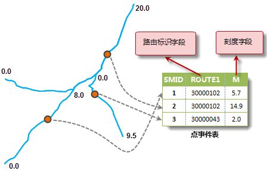
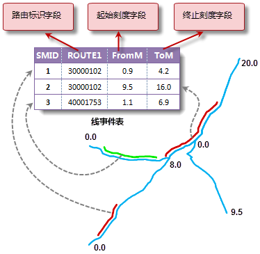
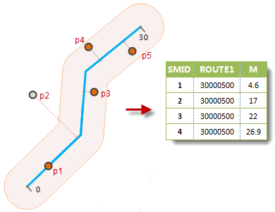

### 事件（表）类型

事件分为点事件和线事件，分别存储于点事件表和线事件表中。

  * **点事件和点事件表**

点事件发生在路由上的一个精确点位置上。例如，发生在公路上的交通事故、高速公路上的测速仪器、公交站点、管线上的阀门等。在点事件表中，每个点事件都对应一个路由
ID（路由标识字段），并使用一个字段来存储描述点事件的位置，即刻度字段。

  
 
  * **线事件和线事件表**

线事件发生在路由的一段上。如某段道路的铺设材质、交通拥堵情况、管线的管径大小、发生坍塌的路段等。如下图所示，在线事件表中，每个线事件必须包含一个路由ID
（路由标识字段），并使用起始刻度字段和终止刻度字段来存储描述事件的位置。

  
  
**起始刻度字段：** 用于存储线事件的起点在路由上的对应的刻度值。

**终止刻度字段：** 用于存储线事件的终点在路由上的对应的刻度值。

### 生成事件表

生成事件表是生成包含点事件或者线事件的属性表的过程。事件表可以手工输入信息，也可以通过已有的点或者线数据集结合路由数据集生成事件表。

按照生成事件类型的不同，可以分为点事件表的生成和线事件表的生成。

  * **生成点事件表**

由点数据和路由数据生成点事件表。按照指定的查找半径，对路由对象生成一个缓冲区域，这个区域称为查找范围。落在该区域内的点用于生成事件表，每个点对应一个事件。查找范围外的点不会生成事件。生成后的点数据，会增加两个属性字段，分别保存路由
ID 和 M 值。

  

  * **生成线事件表**

与点事件表达生成类似，如果线对象完全落入查找范围内，则每条线会生成一个线事件，属性字段包含了路由标识
ID、线起点的刻度值和线终点的刻度值。未落入或者部分落入查找范围的线对象不会生成线事件。下图是生成线事件表的示意图，线L2到路由的最大直线距离大于查找半径，因此不会生成对应的事件。
