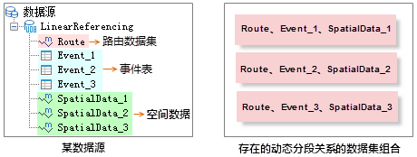

生成空间数据涉及三个角色：路由数据集、事件表和空间数据。生成空间数据时，应用程序会自动建立并存储三者的动态分段关系，即根据路由
ID、刻度字段等信息建立三者之间的对应关系。动态分段主要用于实现三个角色间的联动修改。需要注意建立动态分段关系的三个数据必须在同一数据源中。

   
  
动态分段关系建立后，一方面需要根据事件表、路由数据和空间数据三者之间的关系，将它们动态的管理起来；另一方面，修改其中一个数据（如事件表），其他数据（如空间数据）会发生相应的变化。

###  动态分段关系管理

在动态分段关系中，路由数据和事件表是一对多的关系，路由数据集与空间数据是一对多的关系，而事件表和空间数据为一对一的关系，如下图左图所示：在数据源
LinearReferencing 中，数据集 Route
为路由数据集，SpatialData_1、SpatialData_2、SpatialData_3分别为事件表
Event_1、Event_2、Event_3与 Route
所生成的空间数据，那么该数据源中存在的动态分段关系有三个）所示。也就是说，路由数据集可以被多个事件表共用从而生成多个空间数据，但一个事件表只能对应一个空间数据。

  

###  动态分段关系联动

生成空间数据之后，用于生成空间数据的路由数据集、事件表与生成的空间数据之间就建立了动态分段关系。有了这个动态分段关系，在修改三者中的一个时，其他两者会自动发生相应的变化，SuperMap
称之为联动修改，是动态分段功能的重要特征。

目前，SuperMap 应用程序支持以下几种方式的联动：

1. **事件的描述信息发生变化。这种情况在事件表与空间数据之间发生联动。**

修改事件的描述信息，是指修改除路由标识字段和刻度字段之外的一般属性字段，如公路限速信息可能根据天气、施工等因素的变化做临时性修改。如果修改事件表中的描述信息，从该事件表生成的空间数据的属性信息也会自动进行相应的修改。同样的，修改空间数据属性表中的一般属性字段时，其对应的事件表也会动态改变。

2. **事件发生的路由位置发生变化。这种情况在事件表与空间数据之间发生动态变化。**  
修改事件发生的位置，是指修改事件表或空间数据中的刻度值字段。如果修改事件表中某条记录（事件）的刻度值，那么对应的空间数据中该事件对应的点或者线对象的几何信息和属性表中对应记录的刻度字段也会做相应修改；如果修改生成的空间数据的属性表中的刻度字段的值，对应的对象的几何信息也会修改，事件表中的相关联的事件的刻度字段的值也会动态发生同等变化。如果是线事件，可以修改起始刻度或者终止刻度，事件的长度和位置可能发生变化。如下图所示，是生成空间数据之后，将对应事件表中第一条事件的起始刻度和终止刻度由（20.78,79.37）修改为（150.00,180.00）前后，对应空间数据中对应该事件的线的变化，可以看出，当事件的刻度值发生变化后，对应的空间数据也自动进行对应的修改。  
     
需要注意：如果修改后的刻度值与对应路由的 M 值不存在交集，例如，修改后起始刻度和终止刻度分别为26、60，而对应路由的 M
值范围为3到20，空间数据的几何信息不会改变；如果修改后线事件的一部分位于路由上，则对应的空间数据自动修改为只对应这一部分的数据。

3. **事件发生的路由改变。这种情况下，空间数据会根据路由数据集的修改发生变化，而修改空间数据时，对应的路由数据不会发生变化；事件表与空间数据之间会发生联动修改。**  
这种情况适用于由于数据错误或者变更导致事件所发生的路由需要修改的情形，具体分为以下三种情况：

  * 如果修改的是路由对象的空间几何信息，对应的空间数据中相关对象的几何信息也会自动修改。如果发生事件的路由的位置和刻度值发生变化，如管道维修后走向发生了变化，它的形状和刻度值可能都需要修改。这时就需要对路由对象本身的空间几何信息进行修改，如旋转、移动，修改刻度值等。修改后，对应的空间数据中相关对象的几何信息会作相应的变化，即对应的事件和空间数据将重新定位。
  * 如果修改的是事件表的中某记录的路由 ID，则空间数据中与之关联的对象的几何信息和属性表中的路由 ID 字段也会随之动态改变。如下图所示的事件表及其对应的空间数据，将事件表中第一条记录的路由 ID 由1改为2之后，该记录对应的空间数据也发生了变化，被定位到了 ID 为2的路由上面。    
    
**注意**：如果修改路由数据集属性表中路由 ID 字段的值，该属性表可以修改成功，但对应的事件表和空间数据不会发生变化。  
  * 事件表的表结构发生变化。此种情形下空间数据的属性信息会随着事件表的变化而发生同等变化。

事件表的表结构发生变化是指增删或修改字段，例如，为高速公路收费站点事件表增加一个字段，用来描述站点建立的时间。对事件表的表结构进行修改后，对应的空间数据的属性表结构也会自动做同样的修改。

### 注意事项

1. 用于生成空间数据的事件中必须包含路由标识字段和刻度字段（点事件包含刻度字段，线事件包含起始刻度字段和终止刻度字段）。路由标识字段的值用于将事件对应的点或线定位到正确的路由上，刻度字段的值使事件对应的点或线能正确定位。事件表中的路由标识字段、刻度字段以及其他描述事件的属性，都会包含在生成的空间数据的属性表中。
2. 生成的空间数据，会在结果数据集中添加一个名为“Event_SMID”的字段，用于存储事件表中对应事件的 SMID。特别提醒，不能修改该字段的内容，否则可能导致联动结果错误。
3. 由于事件表与空间数据存在一对一的关系，如果某事件表已经存在一个动态分段关系，则不能再次用于生成空间数据，除非删除已经存在的动态分段关系。
4. 建立动态分段关系后，如果直接删除一个存在动态分段关系的数据（路由数据集、事件表或空间数据），应用程序会弹出对话框提示用户是否删除关联关系并删除数据集。因为只有先删除该数据与其他数据之间的存在的动态分段关系后，才能对该数据进行操作。选择“是”，将删除该数据与其他数据的动态分段关系，并删除该数据；选择“否”，取消当前操作。