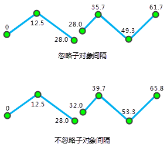

### 使用说明

校准是调整路由测量值，使其与已知的参考点保持一致的过程，通过读取参考点数据集中保存在属性表的刻度值。有关校准路由的更多内容，请参阅[校准路由概述](AboutCalibrate.html)。

### 操作步骤

1. 在“ **交通分析** ”选项卡的“ **动态分段** ”组中，单击“ **动态分段** ”按钮，弹出动态分段“流程管理”窗口，在左侧窗口中单击“校准路由”按钮。  
<!--    -->
2. 在右侧参数设置窗口中，选择用于需要校准的路由数据。在右侧窗口的路由设置区域，选择路由数据所在的数据源、数据集以及路由标识字段。
3. 选择参考点数据。在右侧窗口的参考点数据集设置区域，选择用于校准路由的点数据集所在的数据源、数据集、路由标识字段和刻度值字段。
4. 设置其他参数。 
   * **校准方式：** 分为按距离校准和按刻度值校准。有关这两种校准方式的介绍，请参见[校准路由概述](AboutCalibrate.html)相关内容的介绍。
   * **错误信息字段：** 设置错误信息要保存的错误字段。如果在校准路由过程中发生错误，应用程序会自动添加该错误字段到参考点数据集的属性表中，存储校准路由错误信息，方便追踪错误原因。下表列出了可能出现的错误信息及其含义：
  
   * **容限值:** 设置校准容限和容限值的单位。  
校准路由时可以给定一个距离值，称为校准容限。当参考点到路由的最短距离小于给定的校准容限值时，我们就说该参考点在校准容限范围内。如果参考点到路由的最短距离大于给定的校准容限，则认为该参考不在校准容限范围内。容限默认值与数据集的坐标系有关，具体说明请参见[容限说明](../DataProcessing/Tolerance.html)。  
   * **忽略子对象之间的间隔：** 设置是否忽略子对象之间的间隔。默认忽略子对象之间的间隔。路由可以是包含多个子对象的复杂对象。当两个子对象不连续时，就会产生间隔。是否忽略子对象的间隔影响着路由刻度值的连续性，如果忽略子对象的间隔，刻度值将是连续的，否则就是不连续的，此时子对象的间隔的距离就是两个端点的直线距离。  
如下图所示，忽略子对象间隔时，第一个子对象的终点的 M 值和第二个子对象起点的 M 值相同；不忽略子对象间隔时，第二个子对象的起点的 M 值就是第一个子对象的终点 M 值加上两者的间隔的直线距离 。  
  
   * **保留没有参考点经过的路由对象**： 设置结果路由数据集中是否保留没有参考点经过的路由对象。  
以下两种情形被视为路由没有参考点经过，从而会导致路由对象不会被校准：  
     1. 参考点数据中没有参考点的路由 ID 与路由对象的相同，则该路由对象不会被校准。
     2. 与路由对象的路由 ID 相同的参考点才可能被用于校准该路由，如果这些参考点都不在该路由校准容限范围内，那么该路由将没有参考点经过，意味着该路由没有被校准。

用户可以根据实际研究的需求决定是否保留这些未被校准的路由。

5. 设置校准后的结果，需要设置路由数据保存的数据源，以及路由数据集的名称。
6. 设置完成后，单击“准备”按钮，表示当前步骤准备完毕，随时可以执行。准备完毕的流程，会置灰，不能修改；如需修改设置的参数，可以单击“取消准备”按钮进行修改。
7. 准备完毕后，“执行”按钮可用。单击“执行”按钮，执行该步骤。

**注意**：单击“准备”下拉按钮，会弹出下拉菜单。“全部取消”功能，用来取消所有已经准备好的步骤的准备状态。

###  相关主题

<!--   -->
[校准路由概述](AboutCalibrate.html)
