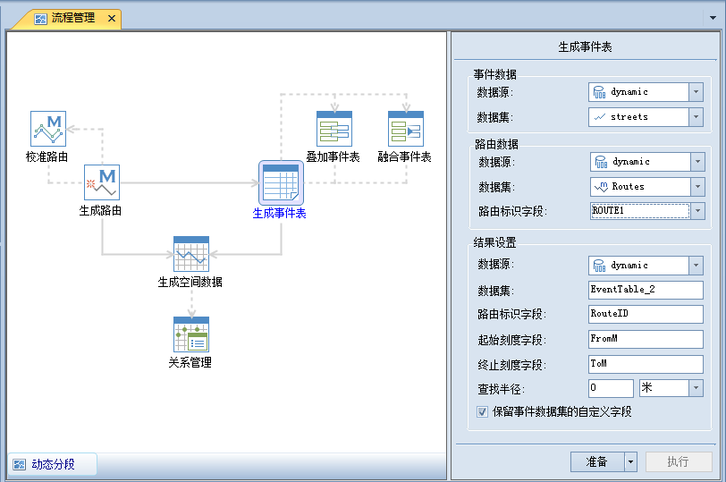

事件表实际上就是一个属性表，其中每一条记录代表了一个事件，除了必须包含路由标识字段、刻度字段外，还可以包含其他用于描述事件的其他属性信息。

SuperMap 应用程序提供了对事件表基本操作功能，如生成事件表、叠加事件表和融合事件表。

### 使用说明

生成事件表就是生成包含点或者线事件的属性表的过程。事件表可以手工输入信息，也可以通过已有的点或者线数据集结合路由数据集生成事件表。

  * 一种是人工建立一个属性表，添加路由标识字段、刻度字段和其他属性字段，并输入相应的属性信息来生成事件表。这种方式虽然简单，但往往需要耗费较多的人力物力。
  * 另一种方式是通过点或线空间数据（称为事件数据）和用于参考的路由数据来自动生成事件表。生成的事件的刻度值和位于哪条路由需要从该路由数据中获得。

有关点事件表和线事件表的详细介绍内容，请参阅[事件表概述](AboutEventTable.html)。

### 操作步骤

1. 在“ **交通分析** ”选项卡的“ **动态分析** ”组中，单击“ **动态分段** ”按钮，弹出生成事件表“流程管理”窗口，在左侧窗口中单击“生成事件表”按钮，切换到“生成事件表”窗口。 
<!--    -->
2. 在右侧参数设置窗口中，设置事件数据相关的参数。这里选择点（或者线）事件数据，需要设置事件数据所在的数据源以及数据集。
3. 设置路由数据相关的参数。在路由数据设置区域，选择路由数据所在的数据源、数据集以及路由标识字段。   
**路由标识字段** ：设置路由标识字段名称，用于存储对应路由数据的 ID。
4. 设置结果相关的参数。在结果数据设置区域，选择生成的事件表要保存的数据源、事件表名称、路由标识字段名称、刻度字段名称以及其他参数。 
    - **路由标识字段：**设置生成的事件表中路由标识字段的名称，该字段用于记录发生在某一段路由上的事件表位置，事件表和路由数据通过路由标识字段信息建立关系，其中事件表的路由标识 ID 与路由数据中的路由 ID 是一一对应。
    - **刻度字段** ：设置结果事件表的刻度字段名称，用于记录点在路由上刻度值(M 值)。对于线事件表，需要分别设置起始刻度字段和终止刻度字段。其中**起始刻度字段** 用来存储线事件的起点在路由上的对应的刻度值； **终止刻度字段** 用来存储事件的终点在路由上对应的刻度值。
    - **查找半径：**设置查找半径和单位。对路由对象以该值为半径扩展出的缓冲区域称为查找范围，位于该范围之外（包括部分在查找范围外）的点或线对象将不能在事件表中生成记录。判断点对象或者线对象是否在查找范围之内的依据是点对象或者线对象上任意节点到路由的直线距离是否在查找范围之内。以生成线事件表为例，如果线对象的某一个节点到路由的直线距离大于查找半径，则认为该线不在查找范围内。反之，线对象上所有节点到路由的直线距离都小于查找半径时，即使部分线位于查找范围之外（可能是路由数据有曲折或者拐弯所致），也会生成相应的线事件。  
设置完单位后，在生成事件表时，应用程序会将查找半径的值进行换算，使其与生成事件表的参考路由数据的坐标系单位保持一致。
    - **创建距离字段：** 该参数仅对点事件表有效。用来设置是否生成距离字段。距离字段用于存储点到路由的直线距离。默认创建距离字段。
    - **只记录点最近的路由：**该参数仅对点事件表有效。用来设置是否只查找最近的路由。选中该项，当某个点在多条路由的查找范围内时，则只生成距离该点最近的路由上的事件；如果不选中该项，则只要该点在路由的查找范围内，就生成对应的事件。例如，当某点在三条路由的查找范围内，如果只查找最近距离的路由，则结果事件表中只生成一条事件记录，否则会生成三条分别对应三条路由的事件记录。默认只记录点最近的路由。
    - **保留事件数据集的自定义字段：** 用来设置是否在结果事件表中保留事件数据中除系统字段外的所有属性字段。默认保留事件数据的自定义字段。

5. 设置完成后，单击“准备”按钮，表示当前步骤准备完毕，随时可以执行。准备完毕的流程会置灰，不能修改；如需修改设置的参数，可以单击“取消准备”按钮进行修改。
6. 准备完毕后，“执行”按钮可用。单击“执行”按钮，执行该步骤。

**注意**：单击“准备”下拉按钮，会弹出下拉菜单。“全部取消”功能，用来取消所有已经准备好的步骤的准备状态。

###  备注

* 创建线事件表和点事件表时，参数设置稍有不同。创建线事件表时，需要设置生成的事件表中，指定起始刻度字段和终止刻度字段；而创建点事件时，在生成的结果中，只需要设置一个刻度字段。其他参数的设置可以参考创建点事件表的操作步骤。
* 合适的查找半径对创建事件表具有十分重要的实际意义。在实际应用中，如果查找半径设置过大，既没有实际的分析意义，同时也可能导致得到的事件表刻度值不理想。因此建议在生成事件表时，输入合理的查找半径。

###  相关主题

<!--   -->
[事件表概述](AboutEventTable.html)