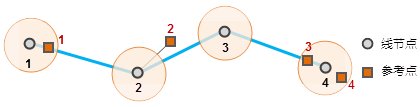
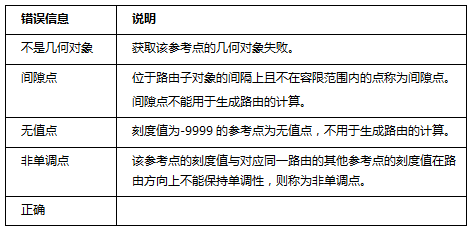

实现动态分段的首要步骤是获得路由数据。每一条路由具有唯一标识值（路由ID）和刻度值（M值），生成事件表时，事件发生的路由和刻度值（线事件包含起始和终止刻度值），需要参考路由数据集中的路由ID和M值。

生成路由数据集是通过点数据或者线数据集关联刻度字段生成路由数据集。同时支持对生成的路由数据集进行对象编辑的功能。

### 使用说明

SuperMap 桌面提供了四种方式生成路由数据集，即线参考点刻度、线单字段、线双字段和线长度四种方式。

* **线参考点刻度** ：根据线数据和参考点数据生成路由数据集。 此种方式生成路由的过程如下：首先通过路由标识字段值将参考点对应到线数据集上，再根据参考点的刻度值来确定线数据节点的刻度值，从而得到路由数据集。参考点的刻度值存储在其属性字段中。 依据参考点与线数据中节点的位置关系，又可分为以下三种情形：
    1. 参考点与线数据集的节点重合，或者在给定的容限范围内，会将参考点的刻度值直接赋给该节点。当节点容限范围内有多个参考点时，取距离最近的参考点的刻度值。
    2. 参考点不在线数据集的节点容限范围内。如果参考点到对应弧段的垂距小于容限，则视为“在线上”，那么该参考点的刻度值可能用于计算节点的 M 值；如果垂距大于容限，则视为“不在线上”，不会参与计算节点的 M 值。
    3. 线数据周围没有可用于计算的参考点，即节点的容限范围内没有参考点，参考点同时没有在线数据集上。这种情况下线对象不会生成对应的路由。此种方式生成的路由数据的对象数和原有线数据集的对象数可能不一致。   

* **线单字段方式**

这种方式根据线数据的一个属性字段来生成路由数据集，该字段记录了一个刻度值，将作为对应路由的终止刻度值（即一条路由的最后一个节点的 M 值），而该路由的起始刻度值（第一个节点的 M 值）为0，如果有中间节点，则其刻度值通过插值计算获得。此种方式生成的路由数据集的对象数与原有线数据集的对象数一致。

* **线双字段方式**

此种方式根据线数据的两个属性字段生成路由数据集。这两个属性字段存储的刻度值分别作为路由的起始节点的刻度值和终止节点的刻度值。中间节点的刻度值通过插值计算得到。

* **线长度方式**
* 此种方式将线对象的节点到起始节点的沿线长度作为每个节点的刻度值，从而生成路由数据集。显然，此种方式得到路由数据集中，每条路由的起始节点的刻度值为0，终止节点的刻度为线的长度。此种方式生成的路由数据集的对象数和原有线数据集的对象数一致。

### 功能入口

  * 在“ **交通分析** ”选项卡->“ **动态分段** ”组中，单击“ **动态分段** ”按钮，弹出动态分段“ **流程管理** ”窗口，在左侧窗口中单击“生成路由”按钮。(iDesktop)
  * 在“ **交通分析** ”选项卡->“ **动态分段** ”组中，单击“ **动态分段** ”按钮，弹出动态分段可视化建模窗口，在建模窗口中单击“生成路由”按钮。(iDesktopX)
  * **工具箱** -> **交通分析** ->动态分段工具：生成路由；或者将该工具拖拽到可视化建模窗口中，再双击该功能图形。(iDesktopX) 

### 参数说明

  * **生成方式** ：应用程序提供四种生成方式，即线参考点刻度、线单字段、线双字段和线长度。由于生成方式的不同，创建路由时需要设置的参数不尽相同。以下先对相同参数进行描述。
  * **源数据** ：选择用于生成路由数据的线数据所在的数据源、数据集以及路由标识字段。 
    * 生成方式为“线单字段”时，还需设置终止刻度字段。
    * 生成方式为“线双字段”时，还需设置起始刻度字段和终止刻度字段。
  * **参数设置** : 
    * **刻度偏移量：** 路由的刻度偏移量。刻度偏移量设定之后，将会对路由上所有刻度做整体偏移。例如，若某路由对象的一个节点的刻度值为 0.09，设置的刻度偏移量为 10，则在生成的路由数据集中该节点的刻度值为 10.09。默认值为0，即不进行偏移。
    * **刻度因子：** 用于刻度值的单位换算。当已有的刻度值的单位与实际需求不一致时，可以通过刻度因子来进行单位换算。例如，将刻度值的单位从米转换为千米，刻度缩放因子应设置为 0.001。默认值为1，即不进行单位转换。
    * **忽略子对象之间的间距：** 设置是否忽略子对象之间的间隔。默认忽略子对象之间的间隔。路由可以是包含多个子对象的复杂对象。当两个子对象不连续时，就会产生间隔。是否忽略子对象的间隔影响着路由刻度值的连续性，如果忽略子对象的间隔，刻度值将是连续的，否则就是不连续的，此时子对象的间隔的距离就是两个端点的直线距离。 

如下图所示，忽略子对象间隔时，第一个子对象的终点的 M 值和第二个子对象起点的 M 值相同；不忽略子对象间隔时，第二个子对象的起点的 M 值就是第一个子对象的终点 M 值加上两者的间隔的直线距离 。

  

  * **参考点数据集** :当生成方式为“线参考点刻度”时，根据前面的介绍可知，线参考点刻度的方式是根据线数据和参考点数据生成路由数据集。因此需要设置参考点数据集的相关参数。 
    * 选择参考点数据所在的数据源、数据集、路由标识字段、刻度值字段以及错误字段。
    * **错误信息字段：** 输入或者选择错误信息保存的字段。如果在创建路由过程中发生错误，则会将错误信息保存在该字段中。使用线参考点刻度方式生成路由数据集后，应用程序会自动添加该错误字段到参考点数据集的属性表中，存储生成路由错误信息，方便追踪错误原因。下表列出了可能出现的错误信息及其含义：    
---  
    * **容限：** 给定的容限范围。对于在容限范围之外的参考点，不视为路线上的点，将不会用于计算路由的刻度值。详细介绍请参阅本页面使用说明中 **[线参考点刻度](CreateRoute.html#1)** 生成方式的介绍内容。“容限”的默认值与数据集的坐标系有关，具体说明请参见[容限说明](../../Features/DataProcessing/Tolerance)。
  * **结果数据：** 设置生成的路由数据结果，需要设置路由数据保存的数据源，以及路由数据集的名称。
  * 设置完成后，单击“准备”按钮，表示当前步骤准备完毕，随时可以执行。准备完毕的流程，会置灰，不能修改；如需修改设置的参数，可以单击“取消准备”按钮进行修改。(iDesktop) 

注意：单击“准备”下拉按钮，会弹出下拉菜单。“全部取消”功能，用来取消所有已经准备好的步骤的准备状态。

  * 准备完毕后，“执行”按钮可用。单击“执行”按钮，执行该步骤。

### 编辑路由

支持对生成的路由数据集进行对象编辑，支持的对象编辑操作包括：画线分割、画面分割、选对象分割、打断、精确打断、光滑、重采样、合并、连接线等。对象编辑的详细操作请参看[编辑对象 ](../DataProcessing/Objects/EditObjects/EdittingGeometry)。

**注意** ：当对路由对象进行延伸操作以后，延伸部分的M值需要用户根据延伸对象的长度自己去校准M值。