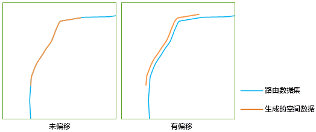

### 使用说明

事件表用属性表的方式记录了点或者线事件发生所在的路由、刻度、事件的描述信息，如交通事故发生时的天气状况、驾驶员体内的酒精含量、当时的车速、路面宽度、铺设材料等。生成空间数据就是根据路由数据集，将事件表中的事件定位的空间中，生成相应的点或者线数据（路由数据），更好地帮助分析者全面的了解此类事件。

生成空间数据涉及三个角色：路由数据集、事件表和空间数据。应用程序会建立并存储三者之间的动态关系。由于事件表与空间数据存在一对一的关系，因此在生成空间数据时需要保证用于生成空间数据的事件不存在动态关系。如果该事件表已经存在于一个动态关系中，需要先删除该关系，然后再生成空间数据。

  

  
有关动态分段关系的更多内容，请参阅[动态分段关系管理概述](AboutRelationManage)。

### 功能入口

  * 在 **交通分析** 选项卡-> **动态分段** 组中，单击 **动态分段** 按钮，弹出动态分段 **流程管理** 窗口，在左侧窗口中单击“生成空间数据”按钮。(iDesktop)
  * 在 **交通分析** 选项卡-> **动态分段** 组中，单击 **动态分段** 按钮，弹出动态分段可视化建模窗口，在建模窗口中单击“生成空间数据”按钮。(iDesktopX)
  * **工具箱** -> **交通分析** ->动态分段工具：生成空间数据；或者将该工具拖拽到可视化建模窗口中，再双击该功能图形。(iDesktopX) 

### 参数说明

设置参与生成空间数据的事件表、路由数据所在的数据源。注意：动态分段功能要求生成空间数据的事件表和路由数据必须位于同一个数据源中。

**事件表数据** :设置事件表数据相关的参数。包括事件表、事件类型、路由标识字段、刻度字段、刻度偏移字段以及错误信息字段等。注意：当事件类型为点事件时，只需要设置一个刻度字段。
* **刻度偏移字段说明**
    * 刻度偏移字段用来设置一个字段，在生成空间数据时，应用程序会根据该字段的值对生成的空间数据（点或者路由对象）进行位置偏移。
    * 偏移的方向、偏移量的正负与路由的方向有关。如果偏移量为正值，生成的空间数据会向路由的左方偏移；如果为负值，则会向路由的右方偏移。在进行偏移时，应用程序会将偏移量在 X、Y 方向上分别做投影，按照投影长度在这两个方向上进行移动。下图是生成空间数据时不设置刻度偏移字段和设置刻度偏移字段的效果对比。
    * 路由方向是根据路由节点的顺序判断的。路由的方向指向节点编号从小到大的方向。路由的左方是指路由方向的左方，路由的右方即路由方向的右方。   
  
* **错误信息字段说明** 错误信息字段直接写入原事件表（点事件表或者线事件表），用于描述事件中未能生成对应的点或线的错误信息。具体错误信息的说明，请参见[错误信息字段介绍](ErrorInfoField)。
  * **路由数据** ：设置路由数据相关的参数。包括路由数据所在的数据源、路由数据集以及路由标识字段。
  * **结果数据** ：设置结果数据相关的参数，包括生成的空间数据的名称。
  * 设置完成后，单击“准备”按钮，表示当前步骤准备完毕，随时可以执行。准备完毕的流程，会置灰，不能修改；如需修改设置的参数，可以单击“取消准备”按钮进行修改。注意：单击“准备”下拉按钮，会弹出下拉菜单。“全部取消”功能，用来取消所有已经准备好的步骤的准备状态。(iDesktop)
* 准备完毕后，“执行”按钮可用。单击“执行”按钮，执行该步骤。

### 注意事项

如果当前数据源下存在由某一个事件生成的空间数据，则无法重复生成新的空间数据，除非通过关系管理窗口删除已经存在的空间数据。
