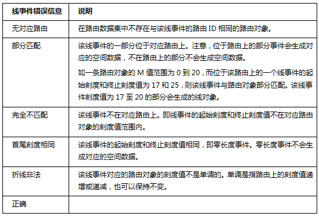

###  使用说明

错误信息字段直接写入事件表，主要用于描述事件未能生成对应的点/线的错误信息。

在生成空间数据时，通常会遇到几种未能成功定位的错误。如果设置了生成错误信息字段，在生成空间数据之后，应用程序会自动将该错误字段添加到事件表中并写入错误。

  * 当生成的空间数据为点数据时，出现的错误信息有以下几种：  
     
  * 当生成的空间数据为线数据时，出现的错误信息有以下几种：    
   