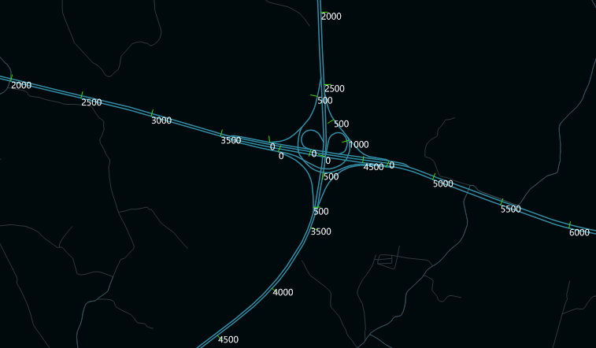

### 使用说明

提取M值是指根据间距提取路由数据的刻度值，提取结果为点数据，可用于在地图中对路由数据进行M值的刻度标识，便于用户了解每段路由的路由值。

### 功能入口

  * 在 **交通分析**选项卡-> **动态分段** 组中，单击 **提取M值**按钮。
  * **工具箱** -> **交通分析** ->动态分段工具：提取M值；或者将该工具拖拽到可视化建模窗口中，再双击该功能图形。(iDesktopX) 

### 参数说明

  * **源数据** ：在对话框中设置待提取的路由数据集，及其所在数据源。
  * **参数设置** :用于标识结果数据对应的路由对象。
  * **提取间隔** :设置提取刻度值的间隔，若设置为100，则表示从起始路由值处，按100为间距依次提取路由的刻度值，若其实路由是0，则提取到的刻度值为100、200、300、400等。 **注意** ：若终止路由值与前一个刻度值之间的差小于提取间距，则不会提取。
  * **结果数据** ：设置结果数据集存放的数据源，及其保存的名称，提取的结果路由刻度值数据集为点数据集。
  * 结果数据集的属性表会保留源路由数据中“路由标识字段”，并且会新增路由的刻度字段（Scale）、角度字段（Angle），根据结果数据集记性配图，即可在地图上通过刻度的方式标识路由值，如下图所示：

  

###  相关主题

 [查询路由M值](InquireRouteM)
