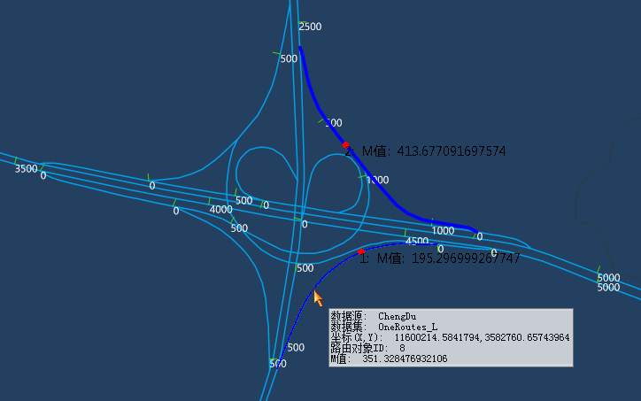

### 使用说明

查询M值功能可查询指定路由图层中，鼠标所在位置的路由M值，便于用户了解路由数据具体路段处的 M 值。

### 操作步骤

  1. 将路由数据集添加到地图窗口中，在图层管理器中选中待查询的可见路由图层。
  2. 在“ **交通分析** ”选项卡->“ **动态分段** ”组中，单击“ **查询M值** ”按钮。
  3. 将鼠标移至地图窗口中，即可查询鼠标所在位置的路由值，在移动鼠标的过程中，在鼠标尾部出现即时消息框，实时显示鼠标所在位置的路由值信息，包括路由数据所在的数据源、数据集，鼠标所在位置的地理坐标（X和Y坐标）、路由对象ID、M值，如下图所示：    
  4. 在路由对象上单击鼠标左键，则会在地图窗口上高亮添加一个点，并显示该点的路由值，同时在输出窗口会显示该路由所在的数据源、数据集、地理坐标（X和Y坐标）、路由对象ID、M值。
  5. 按住 ESC 键或者单击鼠标右键可以取消查询，且按住 ESC 键可以同时清除地图窗口高亮的路由点。

###  相关主题

 [提取路由M值](ExtractRouteM)

