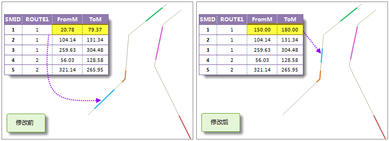
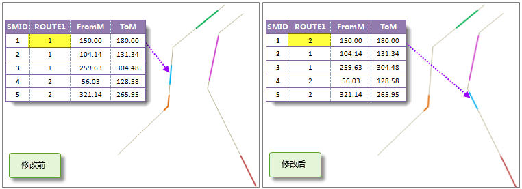
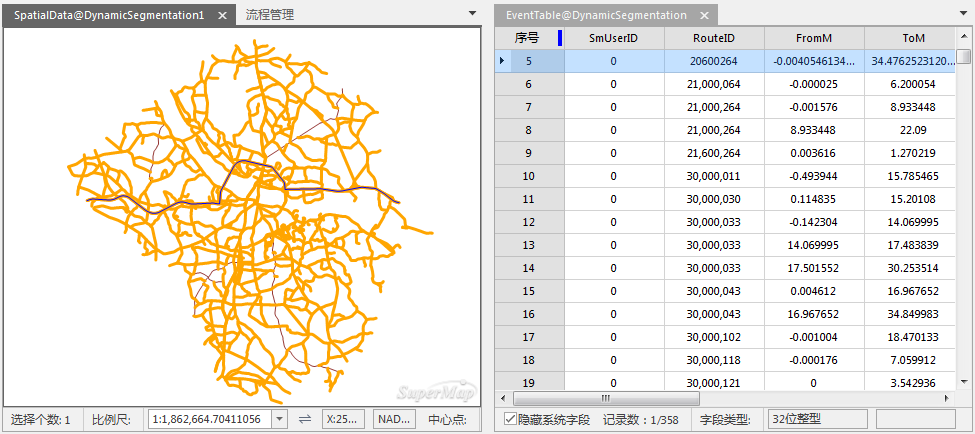

###  使用说明

联动性是动态分段的重要特征。生成空间数据之后，用于生成空间数据的路由数据集、事件表与生成的空间数据之间就会建立动态分段关系。由于这个关系的存在，在修改三者中一个，按照约定，其他两者会自动发生相应的变化。动态分段的联动为修改事件表、空间数据提供了方便。更多有关动态分段关系联动的介绍内容，请参阅[动态分段关系概述](AboutRelationManage.html)。

三者之间动态联动可以分为以下几种情形：

1. **事件表的描述信息发生变化时，事件表与空间数据之间会发生联动。**

修改事件表的描述信息，是指修改除路由标识字段和刻度字段之外的一般性字段，如高速公路由于天气、施工等原因造成的部分道路临时关闭等。当修改事件表中的描述信息，则由该表生成的空间数据的属性信息也会自动进行修改；同样，修改空间数据属性表中的一般属性字段时，其对应的事件表中的信息也会动态的发生改变。

2. **事件发生的路由位置发生变化时，事件表与空间数据之间发生动态变化。**

修改事件发生的位置，是指修改事件表或空间数据中的刻度值字段。如果修改事件表中某条记录（事件）的刻度值，则对应的空间数据中该事件对应的点或者线对象的几何信息和属性表中对应记录的刻度字段也会做相应修改；如果修改生成的空间数据的属性表中的刻度字段的值，对应的对象的几何信息也会改变，事件表中相关联的事件的刻度字段值也会动态发生变化。

对于线事件，可以修改起始刻度或者终止刻度，事件的长度和位置会发生变化。如图1所示，在生成空间数据以后，将对应事件表中第一条事件的起始刻度和终止刻度由（20.78,79.37）修改为（150.00,180.00），修改完成后，空间数据中的对应线的位置发生变化。由此可知，事件的刻度值发生变化后，对应的空间数据也会自动进行修改。

  
  
**需要注意：** 如果修改后的刻度值与对应路由上的 M 值范围不存在交集，例如，修改后起始刻度和终止刻度分别为26和60，而对应路由的 M
值范围为3到20，则空间数据的对应位置的几何信息不会改变。如果修改后线事件的一部分位于路由上，当终止刻度小于路由的最大刻度时，则对应的空间数据自动修改对应的这一部分的数据，反之，当终止刻度大于路由的最大刻度时，修改失败。

3. **事件发生的路由改变时，空间数据会根据路由数据集的修改而发生变化，而修改空间数据时，对应的路由数据不会发生变化；事件表与空间数据之间发生联动修改。**

这种情况适用于由于数据错误或者变更导致事件发生变化的路由需要进行修改的情形，具体分为以下几种情况：

  * 修改事件表中的某条记录的路由 ID，则空间数据中与之关联的对象的几何信息和属性表中的路由 ID 字段也会随之动态改变。如图2所示，将事件表中第一条记录的路由 ID 由1改为2后，该记录对应的空间数据也发生变化，被定位到 ID 为2的路由上。
  * 修改空间数据的路由 ID，则事件表中对应记录的路由 ID 值也会改变；同时，空间数据的几何信息也会根据修改情况发生相应的变化。
  

###  操作步骤

1. 在“动态分段关系管理”对话框中，选中一个动态分段关系，双击该动态分段关系，弹出联动窗口，如下图所示。或者在动态分段关系管理窗口中，单击“编辑”按钮，即可对选中的动态分段关系进行编辑。关于动态分段关系管理功能，请参见[动态分段关系管理](RelationManage.html)。
  
2. 联动窗口左侧显示的为路由数据和空间数据，右侧显示的是事件表。对事件表、空间数据或者路由数据进行修改，根据使用说明中描述的情形，关联数据会发生相应的变化，并能实时的显示在该窗口中。
3. 操作完成后，单击"关闭"按钮，退出当前窗口。