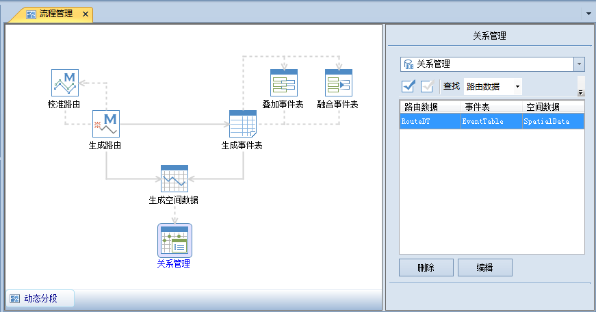

### 使用说明

“关系管理”功能用来对当前工作空间中的所有数据源下的动态分段关系进行管理，主要包括对数据源或者数据集之间动态分段关系的查询和删除以及路由数据集、事件表与空间数据之间联动关系的编辑。

###  操作步骤

1. 在“ **交通分析** ”选项卡的“ **动态分段** ”组中，单击“ **动态分段** ”按钮，弹出动态分段“流程管理”窗口，在左侧窗口中单击“关系管理”按钮。
<!--    -->
2. 在右侧窗口中，列表框区域列出了当前数据源下的所有动态分段关系。单击数据源选择下拉按钮，切换不同的数据源，可以查看其他数据源中的动态分段关系。
3. 查找数据对应的动态分段关系。  
根据输入的数据名称，查找该数据对应的动态分段关系信息。支持利用路由数据、事件表或者空间数据，查找动态分段关系。  
选择要查找的数据类型，在右侧的文本框中输入要查找的数据名称，输入完成后，单击“查找”按钮，查找该数据所属的动态分段关系信息。
4. 删除动态分段关系。  
删除动态分段关系有两种情况：  
（1）仅删除选中的动态分段关系中的所有关联关系；  
（2）删除动态分段关系的时候，同时删除数据，删除的数据类型为事件表或者空间数据。  
删除关系时，在列表区中选中要删除的动态分段关系，然后单击"删除"按钮，弹出提示对话框（如下图所示），单击“是”按钮，确认删除；单击“否”按钮，取消删除操作。  
在删除动态关系过程中，如果勾选“删除空间数据”复选框，则在删除动态分段关系的同时，会删除空间数据；如果没有勾选“删除空间数据”复选框，仅会删除事件表、路由数据和空间数据三者之间存在的动态关系。
5. 编辑动态分段关系。单击“编辑”按钮，可以对建立动态分段关系的路由数据、空间数据和事件表进行联动修改。具体请参见[动态分段关系联动修改](RelationLink.html)。
6. 操作完成后，单击"关闭"按钮，退出流程管理窗口。

###  备注

在“关系管理”窗口中，双击选中的动态分段关系，会弹出动态分段关系联动窗口。关于动态分段关系中的联动，请参阅[动态分段关系联动](RelationLink.html)。