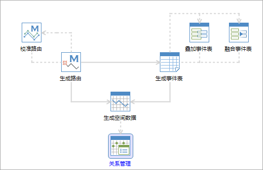

SuperMap 提供的动态分段功能的主要步骤包括：生成路由数据集、生成事件表、事件表的叠加与融合、生成空间数据、动态分段关系管理等。

  

如上图所示，流程图中明确地展示了动态分段过程中的主要步骤以及各个步骤之间的关系。主要的功能按钮通过连接符进行连接。带箭头的实线表示实线连接的两个功能之间按照箭头所指的方向默认存在参数传递，带箭头的虚线表示虚线两端连接的两个功能之间不会发生参数传递。在使用的过程中，单击主要步骤的功能按钮，设置好参数后即可执行。有关流程管理窗口的介绍内容，请参见[流程管理窗口介绍](../UIIntroduct/proceduremanage)。

动态分段各个步骤的详细介绍请参见：

[1、生成路由](CreateRoute)

[2、校准路由](CalibrateRoute)

[3、生成事件表](CreateEvent)

[4、叠加事件表](OverlayEvent)

[5、融合事件表](DissolveEvent)

[6、生成空间数据](CreateSpatialData)

[7、动态分段关系管理](RelationManage)

###  相关主题

 [流程管理窗口介绍](../UIIntroduct/proceduremanage)

