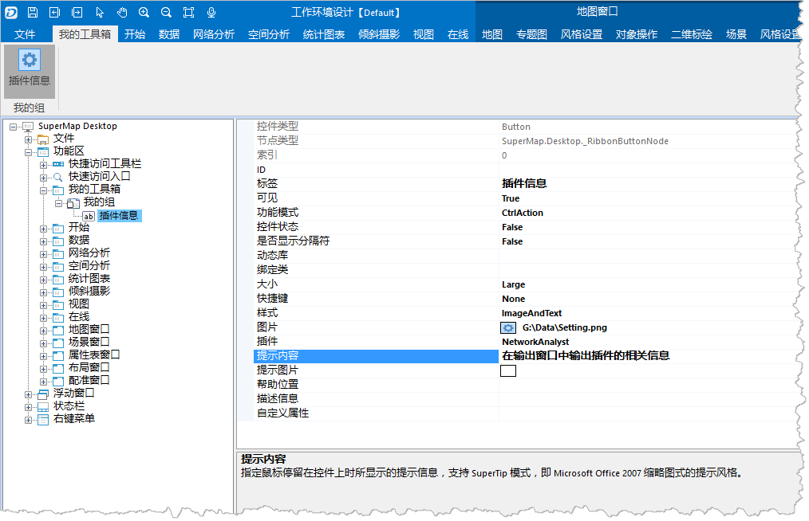

### 目的：向“我的组”中添加一个名为“插件信息”的按钮。

  1. 单击“我的组”右键菜单的“新建按钮”，即可新建一个默认名称为"Button"的选项卡。
  2. 修改"Button"按钮的属性信息如下表所示。  

属性名 | 属性值 | 说明  
---|---|---  
控制状态 | False | 按钮默认的选中状态，默认为 False，非选中状态。  
图片 | Plugin.png |按钮上图片的名称，可以为绝对路径，也可以为相对于执行程序的相对路径。单击[Plugin.rar](img/Plugin.rar)”，下载范例中示例图片Plugin.png 到本地，解压后即可获得该图片。  
标签 | 插件信息 | 按钮的显示名称。  
提示内容 | 在输出窗口中输出插件的相关信息 | 鼠标放在按钮上显示的提示信息。  
大小 | Large | 按钮图标的显示大小。Normal 的显示大小为16*16，Large 的显示大小为32*32。  
样式 | ImageAndText | 按钮的显示风格。Text 仅显示按钮名称，Image 仅显示按钮图标，ImageAndText 按钮图标和名称都显示。  
可见 | True | 按钮默认是否可见，默认为可见，值为 True。  
   
   3. 修改按钮属性信息后，界面展示如下图所示。 
  
    
