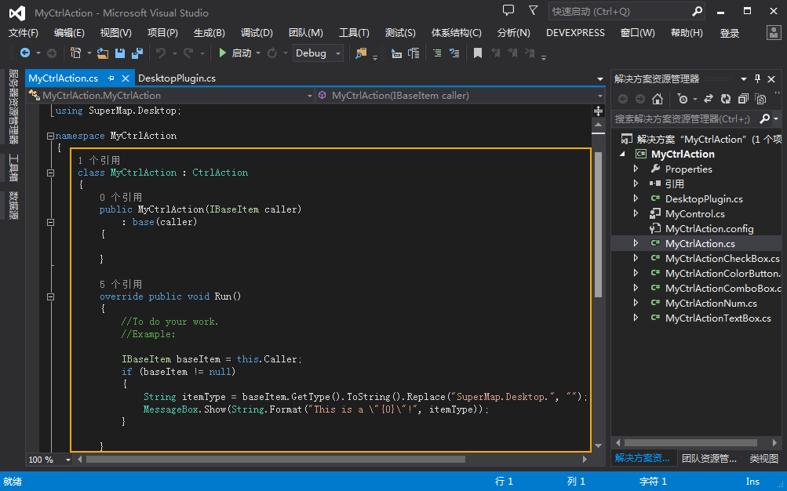
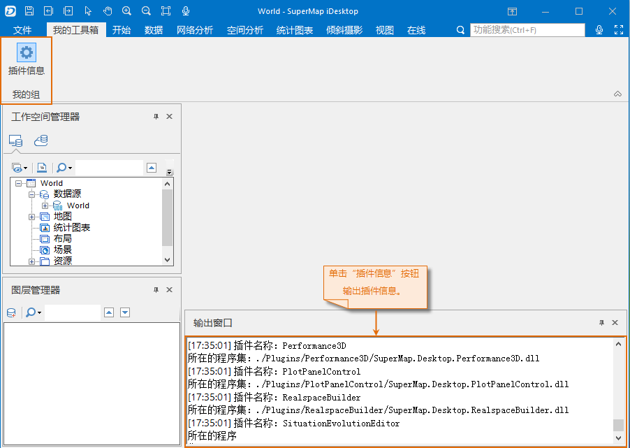

  1. 打开 MyCtrlAction.cs 文件。 

MyCtrlAction.cs 文件中包含了用于响应控件事件触发时所要执行的内容，即与 UI 控件绑定的类，该类必须继承自 CtrlAction 类或实现
ICtrlAction 接口，如下图所示，为 MyCtrlAction.cs 文件的初始状态。

  

  2. 在 MyCtrlAction 类中重写 Run()方法。 

Run()方法是用来响应控件事件，本例中实现的功能为：将  加载的所有插件的名称和所在程序集的全路径信息输出到应用程序的输出窗口中。在
MyCtrlAction.cs 文件中，将 Run() 方法中的代码替换为如下实现代码：

```

                    //获取应用程序中所加载的所有插件的数目
                Int32 pluginCount = SuperMap.Desktop.Application.ActiveApplication.PluginManager.Count;
    
                //遍历应用程序中的所有插件，并将获取的插件的信息输出到应用程序的输出窗口
                for (Int32 index = 0; index < pluginCount; index++)
                {
                    //获取应用程序中指定索引值的插件定义类对象
    
                    Plugin plugin = SuperMap.Desktop.Application.ActiveApplication.PluginManager[index];
    
                    //获取该插件的插件信息类对象
    
                    PluginInfo pluginInfo = plugin.PluginInfo;
    
                    //获取插件的名称
    
                    String pluginName = pluginInfo.Name;
                    //获取插件所在的程序集的全路径
    
                    String pluginAssemble = pluginInfo.AssemblyName;
    
                    //将获取的插件名称和所在的程序集信息输出到应用程序的输出窗口
    
                    SuperMap.Desktop.Application.ActiveApplication.Output.Output("插件名称：" + pluginName + "\r\n" + "所在的程序集：" + pluginAssemble,InfoLevel.Information);
                }
    
```
  3. 编译 “MyCtrlAction”工程，生成 MyCtrlAction.dll 动态库文件，本例中的输出路径为：安装目录\SampleCode\MyCtrlAction\MyCtrlAction\obj\X86\Debug\MyCtrlAction.dll。
  4. 生成 MyCtrlAction.dll 后，可以按照工作环境设计快速入门中的[“CtrlAction”方法](CtrlAction.html)，配置到用户界面中，配置后的界面以及功能执行的结果如下图所示。  
  
  

