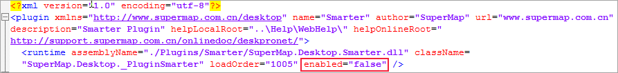
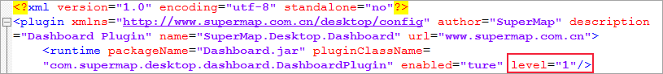
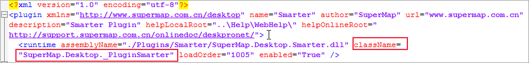

**问：在启动 iDesktopX 桌面后，输出窗口提示“xx 插件加载失败！” 是什么原因？**  
 
**答：**   iDesktopX 存在以下几种情况会提示加载插件失败，以 SuperMap.Desktop.Dashboard 插件为例:

**1.** 当 SuperMap.Desktop.Dashboard.config 配置文件中 **enabled 属性设置为“false**
”时，SuperMap.Desktop.Dashboard 插件加载失败！  
 **原因** ：enabled属性用于设置插件是否可见，设置为“false” 后，插件不可见。     
---  
  
**2.** 当 SuperMap.Desktop.Dashboard.config 配置文件中 **level 属性设置为 1**
时，SuperMap.Desktop.Dashboard 插件加载失败！  
 **原因** ：level 属性用于设置插件等级，除核心插件 Controls 等级为1外，其他插件等级为 2-10 的整数，一般设置为5。
  
---  
  
**3.** 当 SuperMap.Desktop.Dashboard.config 配置文件正确且存在，但是 **对应 jar 包不存在** ，会引起
SuperMap.Desktop.Dashboard 插件加载失败！  
**原因** ：在安装路径\bundles\idesktop_bundles 目录下不存在 Dashboard.jar 包，因此该插件无法加载。

**4.** 当 SuperMap.Desktop.Dashboard.config 配置文件中 **pluginClassName 与 jar
包中的插件类名不一致** ，导致 SuperMap.Desktop.Dashboard 插件加载失败！  
**原因** ：根据 pluginClassName
属性值“com.supermap.desktop.dashboard.DashboardPlugin”，未匹配到对应插件类。
  
---  
  
**5.** 插件类 **DashboardPlugin 中构造函数构造失败** ，导致 SuperMap.Desktop.Dashboard
插件加载失败！  
**原因** : 在插件类 com.supermap.desktop.dashboard.DashboardPlugin
的构造函数中出现异常，导致构造失败。

**6.** **许可** 中没有包含大屏插件许可导致 SuperMap.Desktop.Dashboard 插件加载失败！  
**原因** : 插件 SuperMap.Desktop.Dashboard 在当前许可无法加载！

**7.** 除以上原因外导致 SuperMap.Desktop.Dashboard 插件加载失败！  
**原因** : SuperMap.Desktop.Dashboard插件在构建的过程中失败。  
  

