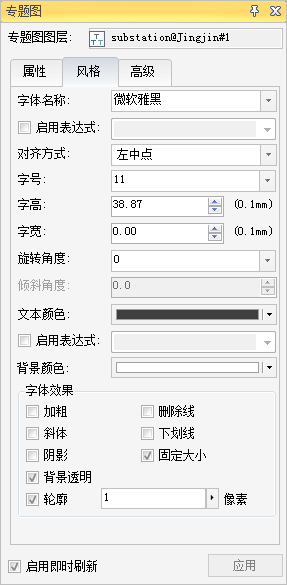
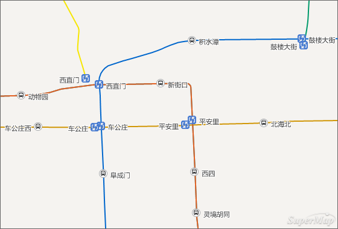

对地图进行标注，可以更加轻松地识别地图上的重要元素。在本例中，将对substation、ChangeStation两个图层进行标注。

**对substation图层进行标注**

substation数据集属性中，存储有各个站点的名称，所以在对其进行标注时，选择相应的属性字段就可以。

1. 在“ **图层管理器** ”中“substation@Jingjin”图层上单击右键，在弹出的右键菜单中选择“ **制作专题图...** ”，弹出“ **制作专题图** ”对话框。
2. 在" **制作专题图** "对话框左侧选择“ **标签专题图** ”，右侧对应的列表中选择“ **统一风格** ”，“ **确定** ”之后弹出“ **专题图** ”对话框并停靠在应用程序界面的右侧。
3. “专题图”对话框中分为“属性”、“风格”和“高级”三个面板，在这里只介绍“属性”和“风格”面板中的参数设置。
* 在“ **属性** ”面板中，“ **标签表达式** ”设置为"站点名称"。
* 在“ **风格** ”面板中，设置“ **字体名称** ”为“微软雅黑”，“ **对齐方式** ”为“左中点”，“ **字号** ”为“11”，其他参数设置，请参见下图。
  

**对ChangeStation图层进行标注**

ChangeStation数据集属性中，存储有各个中转站点的名称，所以在对其进行标注时，选择相应的属性字段就可以。

对ChangeStation图层进行标注的方法步骤，与“ **对substation图层进行标注** ”中一样，在这里就不详细讲述。

substation、ChangeStation两个图层的标注效果如下图所示：

  

对地图标注完成后，点击“ **开始** ”选项卡“ **工作空间** ”组中的“ **保存** ”按钮，将地图命名为“ **北京市地铁线路图**
”，保存地图并保存工作空间。

###  相关主题

 [发布地图](ShareAWebMap)

 [创建布局](MakeALayout)

