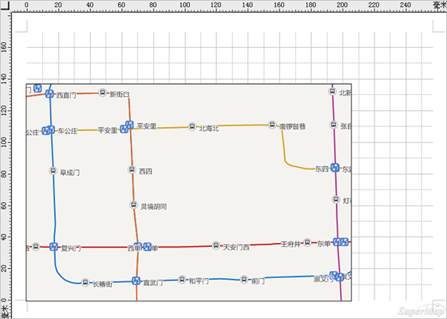
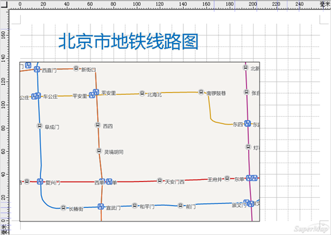
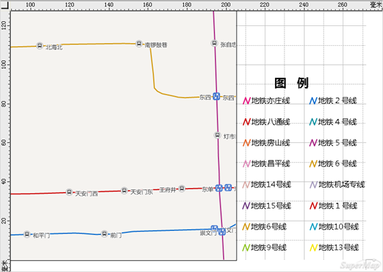
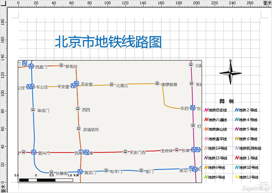

要将地图打印出来，需要创建布局。布局是由一个或多个地图以及其他支持元素（如标题、指北针、图例、比例尺等）组成的。

在这里，将前面制作出来的北京市地铁线路图制作为布局。具体操作步骤如下:

**新建布局**

1. 在 **工作空间管理器** 中的“ **布局** ”结点上单击右键，在弹出的右键菜单中选择“ **新建布局窗口** ”，即可创建一个空白的布局窗口。
2. 在Ribbon上的 **布局** 选项卡“ **页面设置** ”组中，可以设置布局页面的“纸张方向”、“纸张大小”和“页边距”，可以根据出图的实际需求进行设置，在本例中，设置纸张方向为“横向”，纸张大小为“A4”，页边距为“普通”。“ **布局设置** ”组中，支持设置布局页面的横向、纵向页数，在大比例尺出图或者出图范围较大时，可以考虑调整横向、纵向页数。

**插入地图**

1. 在Ribbon上的 **对象操作** 选项卡“ **对象绘制** ”组中，点击" **地图** "按钮，在弹出的下拉列表中选择“矩形”，直接在布局页面相应位置拖拽绘制，矩形绘制完成后，会弹出“ **选择填充地图** ”对话框，下拉列表中会罗列出所有保存在工作空间中的地图，选择要出图的地图即可。在本例中，选择上一步骤中保存的“北京地铁线路图”。
2. 选中添加在布局窗口的地图，可以通过拖拽调整其在布局中的位置。选中后，在右键菜单中选择“ **锁定地图** ”，就可以对当前地图进行放大、缩小、平移位置等浏览操作，操作完成后，需要再点击一次“锁定地图”以对地图解锁。
  

**插入文本**

1. 在Ribbon上的 **对象操作** 选项卡“ **对象绘制** ”组中，点击" **文本** "按钮，直接在布局页面相应位置点击输入文本信息。
2. 选中文本信息，可以通过鼠标拖拽的方式，调整其在布局中位置或者文本的大小。
3. 选中文本信息，在右键菜单中选择“ **属性** ”，在弹出的属性对话框“ **文本信息** ”结点中，可以对文本的“字体名称”、“锚点对齐方式”、“字号”、“文本颜色”等文本风格参数进行设置。本例中，对文本风格进行设置后得到的效果如下图中所示。
  

**插入图例**

图例、比例尺、指北针等是与地图绑定在一起的，所以要插入这些要素，需要先选中布局中的地图。

1. 选中布局上的地图后，在Ribbon上的 **对象操作** 选项卡“ **对象绘制** ”组中，点击" **图例** "按钮，直接在布局页面相应位置绘制图例。
2. 默认绘制的图例，是将地图中所有的图层都显示出来，选中图例，在其右键菜单中选择“ **拆分布局元素** ”，可以将图例拆分为一个个单独的元素。选中这些元素，可以直接对其进行删除、修改等操作。
3. 对图例中的单个要素修改完成后，可以选中所有要素，在右键菜单中选择“ **组合布局元素** ”，对其重新进行组合。本例中对图例重新组合后的局部效果如下图所示：
  

**插入其他布局整饰要素**

其他的布局整饰要素，例如比例尺、指北针、图片、表格等，都可以根据出图的需要进行添加。添加的方法与添加后对该元素的编辑修改，与前面讲到的“插入文本”、“插入地图”基本类似，在这里就不做详细介绍。

下图是初步制作好的布局示意。

  

**布局输出**

制作好的布局，支持输出为图片，也支持直接打印。

在布局窗口中单击右键，选择“ **输出为图片...** ”选项，可将制作好的布局转换成通用的图片格式（诸如 JPG 文件、PNG 文件、位图文件以及
TIFF 影像数据等格式）进行输出，便于在其他环境中应用。

通过“ **布局** ”选项卡中“ **文件操作** ”组的“ **打印** ”下拉按钮，可预览并打印当前布局窗口中布局页面中显示的所有内容。

###  相关主题

 [布局排版打印](../../Features/Layout/layout.html)

