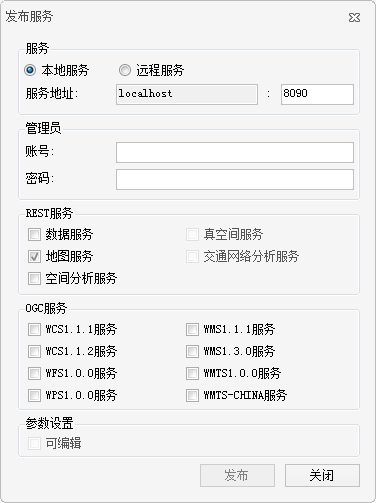
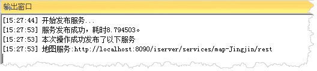
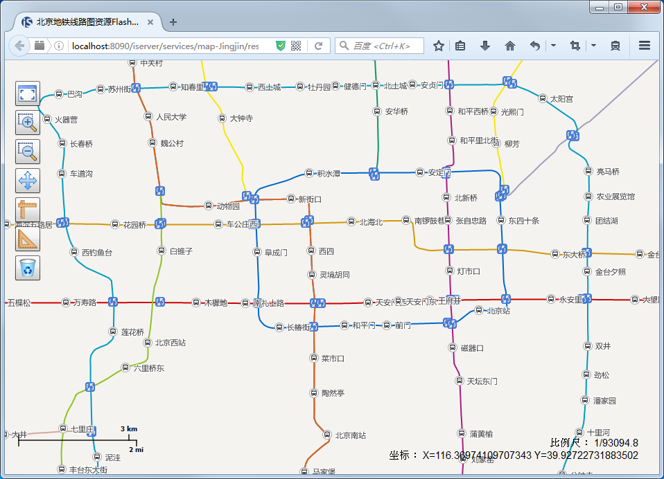

---
id: ShareAWebMap
title: 共享为web地图  
---  
“ **发布服务** ”功能，可以将工作空间中的数据资源服务发布到本地或远程服务器上，以Web网络形式达到资源共享。需要注意的是，发布 iServer
服务适用于  专业版或高级版，在发布 iServer 服务之前，要确保在本地或远程启动了iServer服务，并有管理员账号，才可发布 iServer 服务。

在这里，将前面制作好的“北京市地铁线路图”发布为iServer本地Rest地图服务。操作步骤如下：

1. “ **在线** ”选项卡“ **服务** ”组中，选择“ **发布服务** ”，弹出“发布服务”对话框。
2. “发布服务”对话框中的参数设置，如下图中所示：
  
 
3. 点击“ **发布** ”按钮，输出窗口处会提示发布是否成功，若发布成功，输出窗口会显示所发布的服务类型和各服务链接，用户可复制服务的链接到浏览器中，查看服务发布的结果。如下图中所示。
  

复制输出窗口的Rest地图服务地址，在浏览器中打开的，得到的效果如下图所示。

  

 ###相关主题

[发布iServer服务](../../tutorial/Publish/PublishiserverProcess)

