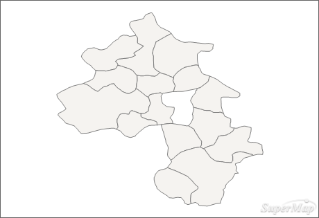
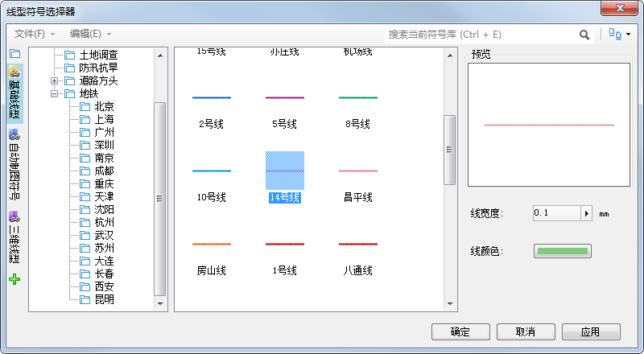
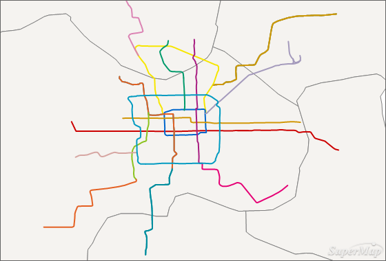
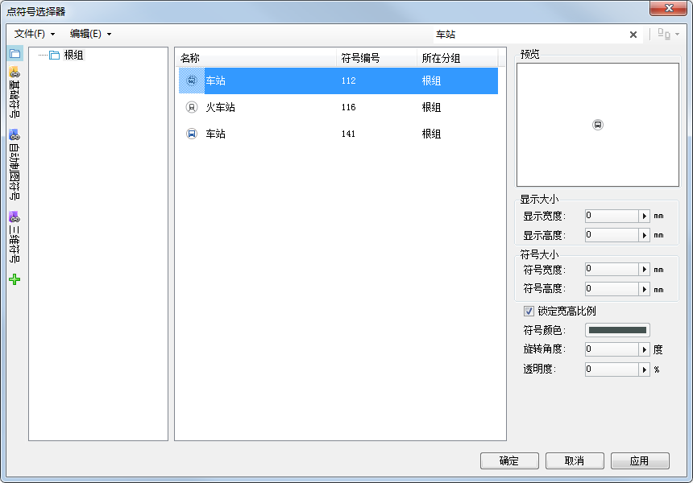
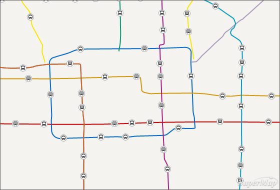
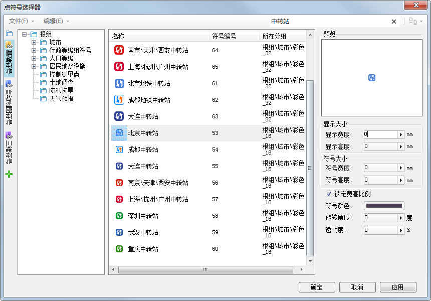
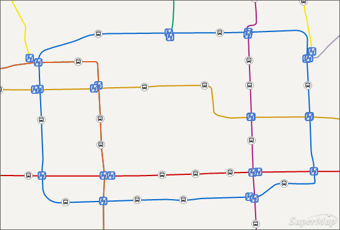

---
id: SymbolizeMapLayers
title: 符号化地图图层  
---  
使用符号可以突出表示出地图图层的属性信息。例如，在表示城市的行政区划图层中，使用圆圈可以表达出每个城市的人口数，但用于符号化每个城市人口的圆圈大小可能会有所不同，而圆圈的可见属性，如形状、大小、颜色、透明度等都是可以定义的。

**设置BaseMap_R图层风格**

BaseMap_R图层代表的是京津地区的行政区划，在本教程中作为底图，所以对其进行单一设色就可以。具体操作步骤如下：

1. 在“ **图层管理器** ”中双击“BaseMap_R@Jingjin”图层，弹出“ **填充符号选择器** ”对话框。 

**注** ：当数据集添加到地图窗口，就被称之为“图层”，图层默认的命名规则为“数据集名称@数据源别名”的方式。

2. 在“ **填充符号选择器** ”中： 
* 将“前景色”设置为“浅灰色”；
* 点击“线型选择”，在弹出的“线型符号选择器”中，设置“线颜色”为灰色（R：127，G：127，B：127）。

其他参数不做修改，得到的BaseMap_R图层风格如下图所示。

  

**设置subway图层风格**

subway图层代表的是北京2014年的地铁线路图，为区分出不同的地铁线路，每一条都用不同的颜色表示。

1. 在“ **图层管理器** ”中选中“subway@Jingjin”图层，在其右键菜单中选择“ **制作专题图...** ”，弹出“ **制作专题图** ”对话框。
2. 在“ **制作专题图** ”对话框左侧列表栏中选择“ **单值专题图** ”，对应的右侧列表栏中选择“ **默认** ”，“ **确定** ”之后弹出“ **专题图** ”对话框并停靠在应用程序界面右侧。
3. " **专题图** "对话框中的参数设置。“专题图”对话框中分为“属性”和“高级”两个面板，在这里只介绍“属性”面板中的参数设置。

* **表达式** ：设置subway数据集中的“Name”字段作为表达式，该字段中存储的是各个地铁路线的名称。当表达式选定后，下方对应的单值列表中会罗列出所有的单值。
* **颜色方案** ：显示和设置每个单值对应的颜色。系统会指定一个默认的颜色方案，当表达式设置完成后，所有单值的颜色按照指定的颜色方案进行渲染。在本例中，每条地铁线路都有约定的颜色，所以“颜色方案”可以不用设置。
* **单值风格修改** ：默认设定的单值风格不满足制图要求时，可以对每个单值的风格进行修改。在本例中，需要修改所有地铁线路的风格。以修改“地铁14号线”的风格为例，具体操作步骤如下：

(1) 选中单值列表中的“地铁14号线”这一行，在“ **风格** ”这一列双击，弹出“ **线型符号选择器** ”对话框。

(2) 在“ **线型符号选择器** ”最左侧tab中选择“ **基础符号** ”，在对应显示的树目录中选择“ **地铁** ”结点下的“ **北京**
”分组。

(3) 在“ **北京** ”分组对应的线型中选择“14号线”，点击“ **确定** ”，选择的线型风格即可被应用在地图上。线型的选择如下图中所示。

  

(4) 其他地铁线路的风格设置，重复上述三步就可以。

**注** ：“ **基础符号** ”是桌面产品中的外挂符号库，完整安装包和绿色精简包中自带。

subway图层制作单值专题图后的效果如下：

  

**设置substation图层风格**

substation图层代表的是北京地铁线路上的车站点，每个站点使用相同的符号表示。

1. 在“ **图层管理器** ”中双击“substation@Jingjin”图层，弹出“ **点符号选择器** ”对话框。
2. 在“ **点符号选择器** ”对话框上的搜索栏中输入“车站”，就可以搜索出当前根组下的所有火车符号。

3. 选择搜索出的第一个符号，在右侧的符号属性设置中，“ **显示大小** ”组中的“ **显示宽度** ”和“ **显示高度** ”均设置为0，即使用符号制作时的大小。点符号的设置如下图所示。

  
 
4. 点击“ **确定** ”，选择的车站符号就被应用在地图上。得到的效果如下图中所示。
  

**设置ChangeStation图层风格**

ChangeStation图层代表的是各个地铁线路上的中转站，每个中转站点也使用相同的符号表示。

1. 在“ **图层管理器** ”中双击“ChangeStation@Jingjin”图层，弹出“ **点符号选择器** ”对话框。
2. 在“ **点符号选择器** ”最左侧tab中选择“ **基础符号** ”，在对话框上的搜索栏中输入“中转站”，就可以搜索出当前根组下的包含的所有中转站符号。

3. 在搜索结果中，找到“北京中转站”栅格符号，在右侧的符号属性设置中，“ **显示大小** ”组中的“ **显示宽度** ”和“ **显示高度** ”均设置为0，即使用符号制作时的大小。点符号的设置如下图中所示。

  

4. 点击“ **确定** ”，选择的中转站符号就被应用在地图上。得到的效果如下图中所示。

  
 

### 相关主题

 [对地图进行标注](LabelMap)

