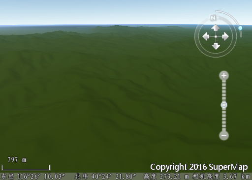
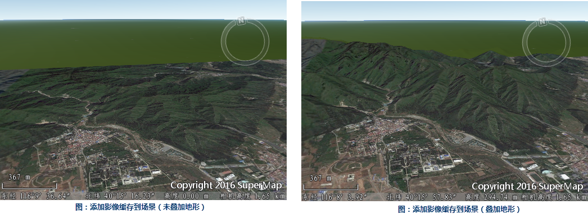
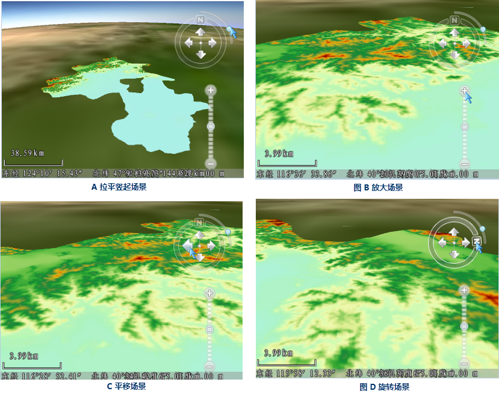
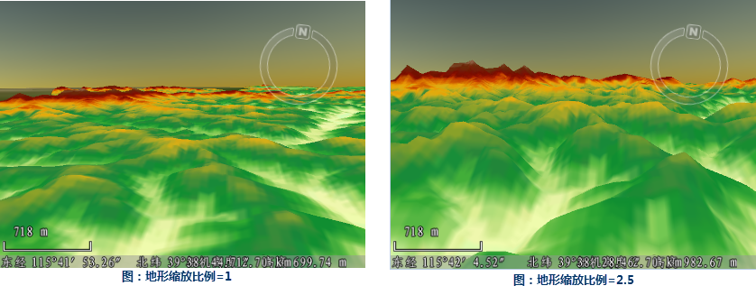
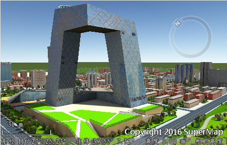

向场景中添加地形缓存数据、影像缓存数据和模型数据，所使用的数据均为  安装包所提供的示范数据生成。

添加地形缓存数据

1. 点击功能区“ **场景** ”选项卡“ **数据** ”组“ **缓存** ”按钮或“ **缓存** ”的下拉按钮“ **加载缓存...** ”；或者右键点击图层管理器中“ **地形图层** ”结点，并选择右键菜单中的“ **添加地形缓存...** ”项。
2. 打开“ **打开三维地形缓存文件** ”对话框。
3. 找到要加载的地形缓存数据（*.sct 文件），本例中使用示范数据Jingjin中地形数据JingjinTerrain生成的JingjinTerrain.sct 文件，选中该文件，点击对话框中的“打开”按钮。
4. 成功添加地形缓存数据后，图层管理器中“地形图层”结点下将增加一个子结点，对应刚刚加载的地形缓存数据。地形缓存添加到场景中的效果如下图中所示。
  

关于地形缓存的更多知识，详细请查看：[ 生成三维地形缓存。

添加影像缓存数据

1. 点击功能区" **场景** "选项卡" **数据** "组“ **缓存** ”按钮或“ **缓存** ”的下拉按钮“ **加载缓存...** ”；或者右键点击图层管理器中“ **普通图层** ”结点，并选择右键菜单中的“ **添加影像缓存图层...** ”项。
2. 打开“ **打开三维影像缓存文件** ”对话框。
3. 找到要加载的影像数据，选中该文件，点击对话框中的“打开”按钮。SuperMap支持的影像缓存文件类型有：*.sci，*.sci3d，*.sit，*.tiff，在本例中加载的是*.sci缓存文件。
4. 成功添加影像缓存数据后，图层管理器中“ **普通图层** ”结点下将增加一个子结点，对应刚刚加载的影像缓存数据。

关于影像缓存的更多知识，详细请查看：[ 生成三维影像缓存。

浏览场景

1. 在图层管理器中，鼠标左键双击普通结点下加载的影像缓存数据对应的图层结点，场景将自动缩放、飞行到影像缓存数据对应的地理范围的视图；
2. 如下面图 A 所示，鼠标左键点击导航罗盘上的圆按钮，并按住不放，沿着四分之一圆弧轨迹拖动圆按钮，可以对场景进行拉平和竖起； 

另外，在场景中按住鼠标中键不放，上下拖动鼠标，也可以实现场景的拉平竖起操作。

3. 如下面图 B 所示，鼠标左键点击导航罗盘上的放大按钮，可以放大场景； 

另外，在场景中滚动鼠标中键，也可以实现缩放场景的操作。

4. 如下面图 C 所示，鼠标左键点击导航罗盘上的上下左右方向键，可以平移场景； 

另外，在场景中按住鼠标左键不放，拖动鼠标，也可以实现平移场景的操作。

5. 如下面图 D 所示，鼠标左键点击导航罗盘上的带有字母“N”的按钮，并按住不放，沿着圆弧轨迹拖动按钮，可以改变场景的正北方向，即旋转场景，改变观察角度； 

另外，在场景中按住鼠标中键不放，左右拖动鼠标，也可以实现旋转场景的操作。

 

设置地形缩放比例

“ **场景属性** ”面板上的“ **地形缩放比例（倍）**
”参数，用来设置地形数据的垂直夸张程度，即对原始的地形数据夸张多少倍，可以在其右侧的文本框中输入数值。这里设置地形缩放比例为
2.5，如下图所示，设置后的地形起伏更加清晰可辨。

 

1. 选择“ **文件** ”-->" **示范数据** "中“ **数据源** ”下的“ **CBD场景数据** ”，将其打开在桌面产品中。
2. 选择其中的CAD模型数据，添加到球面场景中。得到如下图中所示的效果。  

  

关于CAD模型数据集的更多知识，详细请查看：
CAD模型数据集。

### 相关主题

 [第三步：保存场景](Step3_SaveScene)
