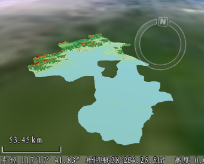

---
id: Application2Step3
title: 第三步：加载数据  
---  
向场景中添加制作好的二维地图、二维矢量数据集和二维栅格数据集，所使用的数据均为  安装包所提供的示范数据，即安装目录\SampleData\ 目录下的数据。

将制作好的二维地图添加到场景中

1. 在工作空间管理器中，鼠标选中 China400 工作空间中的“中国 1：400 万地图”的地图结点，按住鼠标左键不放，将该地图拖放到当前场景窗口中；
 
2. 图层管理器中，“普通图层”结点下增加一个地图图层的子结点，对应该地图，双击该地图图层结点，场景将飞行到其地理范围，如下图所示。

将二维数据集添加到场景中

* **添加栅格数据集**

1. 将栅格数据作为地形数据添加到场景中：在工作空间管理器中，选中 Jingjin 数据源下的 JingjinTerrain 栅格数据集，右键点击鼠标，在弹出的右键菜单中选择“添加到当前场景”或者直接将该栅格数据集拖放到当前场景中；
2. 弹出如下所示的对话框，询问用户该栅格数据集是作为地形数据还是作为影像数据加载到场景中，如下所示；

3. 这里同时勾选对话框中的两个复选框，即将该栅格数据集分别作为地形和影像数据加载到场景中；
4. 添加 JingjinTerrain 栅格数据集后，图层管理器中增加了两个图层，分别位于“普通图层”结点下和“地形图层”结点下；
5. 双击“普通图层”结点下栅格数据图层，飞行到该数据的地理范围内，浏览数据到合适的视角。  
    
      

* **添加矢量数据集**

1. 在工作空间管理器中，选中 Jingjin 数据源下的矢量数据集，包括：BaseMap_P、Road_L 数据集，右键点击鼠标，在弹出的右键菜单中选择“添加到当前场景”或者直接选中的数据集拖放到当前场景中；
2. 添加矢量数据集后，图层管理器中增加了两个图层，位于“普通图层”结点下；
3. 双击两个图层中任意一个图层对应的结点，使场景飞行到数据集所处的地理范围。  

